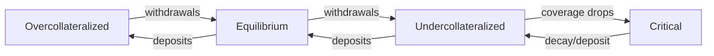
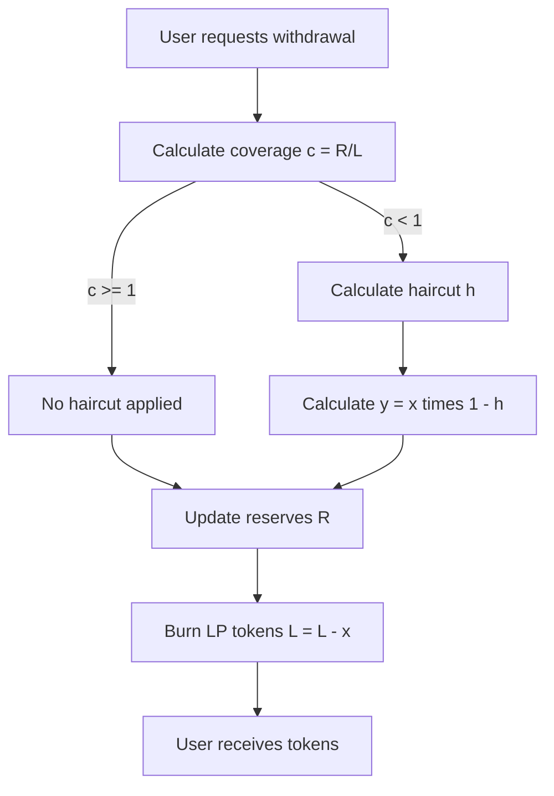
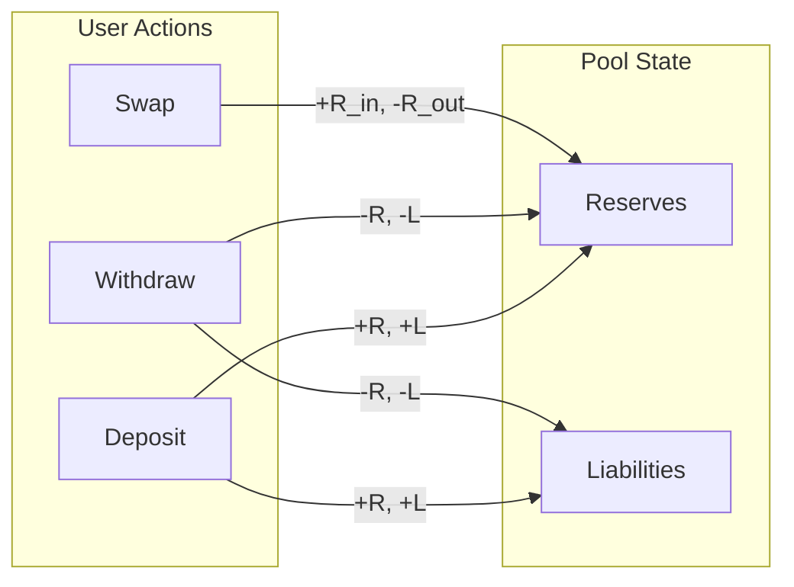

# Inventory Management

> Inventory-aware market making using Asset-Liability Management (ALM) and the Avellaneda-Stoikov framework

---

## 1. Overview

AIMM uses **Asset-Liability Management (ALM)** inspired by [Wombat Exchange](https://docs.wombat.exchange/concepts/coverage-ratio) and [Platypus Finance](https://medium.com/platypus-finance/platypuss-asset-liability-management-eli5-92a1ee85b17):

- **Reserves** `R`: Actual tokens held by the pool (assets)
- **Liabilities** `L`: LP claims against the pool (what we owe depositors)
- **Coverage Ratio** `c`: `R / L`

This decouples pricing from reserves, enabling inventory-aware market making.

### 1.1. ALM State Machine

### 1.2. Beyond Pool-Wise Invariants

Traditional AMMs (Uniswap, Curve) enforce strict **pool-wise invariants** (e.g., `x · y = k`, or Curve StableSwap's `A · n^n · Σxᵢ + D = A · D · n^n + Dⁿ⁺¹/(n^n · ∏xᵢ)`) that don't scale well to N-asset scenarios without specialized geometry. Balancer generalizes via weighted geometric mean (`∏ xᵢ^wᵢ = k`); Orbital/CCMM (Orbswap) uses an n-dimensional spherical invariant `∑(r − xᵢ)² = r²` with polar-coordinate ticks. AIMM replaces all of these with:

- **Per-asset tracking**: Each asset maintains independent reserves and liabilities
- **Feedback control**: Inventory skew acts as a dynamic rebalancing signal (Avellaneda-Stoikov framework)
- **Scalability**: Naturally handles any number of assets without invariant constraints

---

## 2. Coverage Ratio

### 2.1. Definition

$$c = R/L$$

where:
- $c$ = coverage ratio
- $R$ = reserves (actual tokens held)
- $L$ = liabilities (LP claims)
- $c = 1$ means 100% coverage
- $c < 1$ means undercollateralized
- $c > 1$ means overcollateralized

[^0]: **Solidity implementation**: Returns `(reserves * WAD) / liabilities` where `WAD = 1e18`, so `coverage = 1e18` represents 100% coverage. See `LibPricing.calculateCoverage()`.

### 2.2. Key Thresholds

| Coverage | State | Behavior |
|----------|-------|----------|
| **≥ coverageMax** | Overcollateralized | Max discount (skew = -100), incentivize selling |
| **100%** | Equilibrium | Zero skew, normal pricing |
| **≤ coverageMin** | Undercollateralized | Max premium (skew = +100), withdrawal haircuts apply |
| **< coverageMin** | Emergency | Decay mechanism may activate |

**Note**: `coverageMin` and `coverageMax` are parametric (defaults: 50% and 200% respectively).

### 2.3. Coverage to Skew Mapping

| Coverage | Skew | Effect |
|----------|------|--------|
| 200%+ | -100 | Max discount |
| 150% | -50 | Moderate discount |
| 100% | 0 | Equilibrium |
| 75% | +50 | Moderate premium |
| 50% | +100 | Max premium |

See: `LibPricing.calculateCoverage()`

---

## 3. Inventory Skew (Coverage → Skew)

> This section covers how skew is computed. For how skew maps to spline position, see [Liquidity Shaping §5](/docs/1.1.2-Liquidity-Shaping#5-inventory-skew-mapping-skew--depth).

### 3.1. AS-Inspired Piecewise-Linear Skew

AIMM uses an **AS-inspired piecewise-linear inventory skew**, not the full Avellaneda-Stoikov derivation. The original AS inventory adjustment is $\delta_{\text{inv}} = \gamma \cdot q \cdot \sigma^2$ — i.e. linear in inventory $q$ **and** scaled by volatility $\sigma^2$. BTR's implementation drops the $\sigma^2$ factor on the skew itself (volatility enters the fee model separately via the volatility band $S_v$) and parameterizes by a dimensionless coverage progress $\pi \in [0, 1]$ for gas-efficiency. See [foundations §2.4](../../../concepts/foundations.md) for the AS reference.

AIMM computes inventory skew using **linear interpolation** between critical bounds:

$$\begin{aligned} \pi &= \frac{|c - c_t|}{|c_b - c_t|} \\ \psi &= \operatorname{sign}(c_t - c) \cdot \gamma \cdot 100 \cdot \pi \end{aligned}$$

where:
- $\pi$ = progress toward boundary, in $[0, 1]$
- $c$ = current coverage ratio
- $c_t$ = target coverage = 1.0
- $c_b$ = critical boundary = coverageMin or coverageMax (parametric)
- $\gamma$ = sensitivity multiplier, basis 10000
- $\psi$ = inventory skew, in $[-100, +100]$
- $\operatorname{sign}(\ldots)$ = $+1$ if $c < c_t$, else $-1$

### 3.2. Skew Curve Properties

| Coverage | Progress | Skew (γ=1.0) | Interpretation |
|----------|----------|--------------|----------------|
| 50%- | 1.0 | +100 | Max premium (pool heavily buying) |
| 75% | 0.5 | +50 | Moderate premium |
| 100% | 0.0 | 0 | Equilibrium (fair mid-price) |
| 150% | 0.5 | -50 | Moderate discount |
| 200%+ | 1.0 | -100 | Max discount (pool heavily selling) |

### 3.3. Gamma Parameter

Gamma is a **multiplier** (not exponent) controlling skew sensitivity:

| Gamma Value | Multiplier | Effect | Use Case |
|-------------|------------|--------|----------|
| **5000** | 0.5x | Half skew | Volatile assets, softer response |
| **10000** | 1.0x | Full skew | Default, balanced |
| **15000** | 1.5x | 150% skew | More aggressive rebalancing |
| **20000** | 2.0x | Double skew | Stable assets, strong incentives |

Higher gamma = steeper linear slope = stronger price incentive for rebalancing.

### 3.4. Design Rationale

Linear skew is the gas-efficient surrogate for the Avellaneda-Stoikov inventory adjustment:
$$\delta_{\text{AS}} = \gamma \cdot q \cdot \sigma^2$$
Linear in inventory position ($q$), scaled by risk aversion ($\gamma$) and squared volatility ($\sigma^2$). BTR's $\psi$ keeps the linearity in coverage progress but moves $\sigma^2$ out into the volatility band $S_v$ (see [Spread & Fees](./1.1.4.%20Spread%20%26%20Fees.md)) so that fee asymmetry and price-skew can be tuned independently.

See: `LibPricing.computeInventorySkew()`

---

## 4. Effective Depth

### 4.1. Concept

**Effective depth** $D$ determines how much volume the pool can absorb at the current coverage level. It's used in price impact calculations via spline traversal.

### 4.2. Formula

When undercollateralized ($c < 1$):

$$D = R + \overbrace{k \cdot (L - R) \cdot \pi^e}^{\text{virtual depth}}$$

where:
- $D$ = effective depth
- $R$ = reserves
- $L$ = liabilities
- $k$ = depth amplifier
- $\pi$ = $(c - c_f)/(1 - c_f)$ progress from floor to target
- $c$ = coverage ratio
- $c_f$ = critical floor (e.g., 0.5)
- $e$ = $1/(1 + 2k)$ exponent, concave curve

[^3]: **Solidity implementation**: The depth amplifier parameter is stored as a raw uint16 and divided by `1,000,000` in the formula: `virtualDepth = (depthAmp * deficit * concaveProgress) / (1_000_000 * WAD)`. The exponent uses the same normalization: `exponent = WAD * 1_000_000 / (1_000_000 + 2 * depthAmp)`. See `LibPricing.calculateEffectiveDepth()`.

### 4.3. Properties

- **At critical floor** ($c = c_f$): $D = R$ (no virtual depth)
- **Concave monotonically increasing** from critical to target
- **At equilibrium** ($c \ge 1$): $D = R$ (full depth = reserves)

### 4.4. Depth Amplifier

The depth amplifier $k$ controls virtual depth addition:

| Value | $k$ | Effect |
|-------|-----|--------|
| **0** | 0 | No amplification ($D = R$ always) |
| **500000** | 0.5 | 50% max virtual addition |
| **1000000** | 1.0 | 100% max virtual addition |

Higher amplification = tighter spreads at low coverage, but increased risk if coverage continues dropping.

---

## 5. Withdrawal Haircut

### 5.1. Haircut Flow Diagram

### 5.2. Power-Law Formula

$$h(c) = \underbrace{(1 - c)}_{\text{coverage deficit}}^{p}$$

where:
- $h$ = haircut ratio
- $c$ = coverage ratio
- $p$ = haircut exponent
- $\eta$ = suppressor parameter

The haircut exponent follows the relation `p = 1 + eta` where `eta` is a dimensionless parameter.

[^2]: **Solidity implementation**: Exponent computed as `p = 1 + eta/MULT_BASE` where `MULT_BASE = 10000`. The parameter `haircutSuppressor` (eta) uses basis 10000, so `eta = 10000` yields `p = 2`. See `LibPricing.applyWithdrawalHaircut()`.

### 5.3. Properties

- $h(0) = 1$ (100% haircut, no reserves -> no withdrawal)
- $h(1) = 0$ (0% haircut, fully covered -> full withdrawal)
- $\eta$ controls curve convexity (higher = gentler)

### 5.4. Suppressor Parameter

| $\eta$ | Exponent $p$ | Curve Shape |
|-------|--------------|-------------|
| **0** | 1 | Linear (harsh) |
| **10000** | 2 | Quadratic (moderate) |
| **30000** | 4 | Convex (gentle mid-range) |
| **40000** | 5 | Very gentle |

### 5.5. Examples

At 80% coverage with $p = 2$:

$$h = (1 - 0.8)^2 = 0.04 = 4\%$$

At 50% coverage with $p = 2$:

$$h = (1 - 0.5)^2 = 0.25 = 25\%$$

See: `LibPricing.applyWithdrawalHaircut()`

---

## 6. Liability Decay

### 6.1. Purpose

Emergency mechanism to restore coverage when undercollateralized for extended periods. Decays LP claims at a controlled rate.

> **Terminology Note**: Throughout documentation, "liability decay", "decay mechanism", and "time decay" all refer to this same system. The `decaySlope` parameter controls the "decay rate".

### 6.2. Activation

Decay activates when $c < c_d$ where $c_d$ = decay start ratio (e.g., `decayStartRatioBps = 980000` means $c_d = 0.98$).

### 6.3. Formula

$$\Delta L = L \cdot \rho \cdot \Delta t$$

where:
- $\Delta L$ = liability decay amount
- $L$ = current liabilities
- $\rho$ = decay slope
- $\Delta t$ = time elapsed

[^1]: **Solidity implementation**: Returns `(L * rho * dt) / WAD` where `WAD = 1e18`. The decay slope `rho` is stored in WAD/second units. See `LibPricing.calculateDecay()`.

### 6.4. Constraints

- **Never decays below reserves**: Caps at $L - R$
- **Stopped at equilibrium**: Decay halts when $c \ge 1$

### 6.5. Parameters

| Parameter | Unit | Example |
|-----------|------|---------|
| `decayStartRatioBps` | 0.0001% | 980000 (98%) |
| `decaySlope` | WAD/second | ~3.17e10 (~1%/year) |

See: `LibPricing.calculateDecay()`

---

## 7. Net Coverage Impact

### 7.1. Purpose

Determines if a swap **improves** or **worsens** pool balance. Used to apply directional fee asymmetry.

### 7.2. Formula

$$\Delta I = I_1 - I_0 \quad \text{where} \quad I = \underbrace{\sum_j p_j \cdot |R_j - L_j|}_{\text{net coverage}}$$

where:
- $\Delta I$ = net coverage impact
- $I$ = $\sum_j p_j \cdot |R_j - L_j|$ sum of imbalances across assets
- $p_j$ = price of asset $j$
- $R_j, L_j$ = reserves and liabilities of asset $j$
- subscripts 0, 1 = before and after trade

### 7.3. Interpretation

| $\Delta I$ | Meaning | Fee Treatment |
|-----------|---------|---------------|
| $< 0$ | Improves coverage | Lower spread (arbitrage-friendly) |
| $> 0$ | Worsens coverage | Higher spread (toxic flow penalty) |
| $= 0$ | Neutral | Base spread only |

See: `LibPricing.netCoverageImpact()`

---

## 8. Coverage Classification

### 8.1. Single Asset

| Coverage | State |
|----------|-------|
| `c > 200%` | OVER |
| `200% >= c > 100%` | ADEQUATE |
| `100% >= c > 50%` | UNDER |
| `c <= 50%` | CRITICAL |

### 8.2. Pool Level

Aggregate coverage across all assets:

$$C = \frac{\overbrace{\sum_j R_j \cdot p_j}^{\text{total reserves}}}{\underbrace{\sum_j L_j \cdot p_j}_{\text{total liabilities}}}$$

where:
- $C$ = pool-level coverage ratio
- $R_j$ = reserves of asset $j$
- $L_j$ = liabilities of asset $j$
- $p_j$ = price of asset $j$

---

## 9. ALM Flow: Deposit

1. User deposits token $A$
2. $R_A \leftarrow R_A + x$ (add to reserves)
3. $L_A \leftarrow L_A + x$ (1:1 LP minting)
4. Coverage remains unchanged
5. User receives LP tokens

### 9.1. Single-Sided Deposits

ALM enables **single-sided deposits**, no forced pairing required. Each token's coverage ratio tracks independently.

---

## 10. ALM Flow: Withdrawal

1. User requests withdrawal of $x$ LP tokens
2. Calculate $c = R / L$
3. If $c < 1$:
    - Calculate $h = (1 - c)^p$
    - $y = x \cdot (1 - h)$ (apply haircut)
4. $R \leftarrow R - y$
5. $L \leftarrow L - x$ (full LP burn)
6. User receives $y$ tokens

### 10.1. Cross-Asset Withdrawal

User can withdraw into a **different asset**:

1. Burn LP tokens for token $A$
2. Swap internal value to token $B$
3. Apply haircut on token $B$
4. User receives token $B$

---

## 11. ALM Flow: Swap

1. User swaps $x$ of token $A$ for token $B$
2. Calculate $\psi_A = f(c_A, \gamma)$
3. Calculate $\psi_B = f(c_B, \gamma)$
4. Price via spline traversal with skew offsets
5. $R_A \leftarrow R_A + x$
6. $R_B \leftarrow R_B - y$
7. Liabilities unchanged (no LP mint/burn)
8. Coverage shifts: $c_A \uparrow$, $c_B \downarrow$

### 11.1. ALM Flows Summary

---

## 12. Parameter Summary

### 12.1. Per-Asset RiskConfig

| Field | Type | Unit | Purpose |
|-------|------|------|---------|
| `coverageMin` | uint16 | 0.01% | Critical coverage floor (e.g., 5000 = 50%, max uint16 = 655%) |
| `coverageMax` | uint16 | 0.01% | Critical coverage ceiling (e.g., 20000 = 200%, max uint16 = 655%) |
| `decayStartRatioBps` | uint16 | 0.0001% | Decay activation threshold |
| `decaySlope` | uint32 | WAD/second | Decay rate |
| `depthAmplifier` | uint16 | raw (scaled by 10^6) | Virtual depth at low coverage |

### 12.2. Per-Asset Sensitivity

| Field | Type | Unit | Purpose |
|-------|------|------|---------|
| `gamma` | uint16 | 0.01% (basis 10000) | Inventory skew multiplier (10000 = 1.0x) |
| `haircutSuppressor` | uint16 | 0.01% (basis 10000) | Withdrawal haircut gentleness |

---

## 13. Comparison: Traditional AMM vs AIMM ALM

| Aspect | Traditional AMM | AIMM ALM |
|--------|-----------------|----------|
| **Price source** | Reserves ratio | Oracle + inventory skew |
| **LP tracking** | Shares of pool | Specific asset liabilities |
| **Deposit** | Both tokens required | Single-sided |
| **Withdrawal** | Pro-rata pool share | Specific asset with haircut |
| **Rebalancing** | Arbitrageurs only | Inventory skew incentives |
| **Under-collateral** | Implicit (IL) | Explicit (`c < 100%`) |

---

## 14. Security Considerations

### 14.1. Bank Run Protection

1. **Withdrawal haircuts** apply progressively during undercollateralization, incentivizing liquidity retention during temporary imbalances (see [§5](#5-withdrawal-haircut))
2. **Coverage-weighted emissions** (see [Liquid Staking §3.2](../../../protocol/04.%20Staking.md#32-liquidity-provider-rewards)) and lower fees on coverage-improving trades (see [Spread & Fees §3.5](./1.1.4.%20Spread%20%26%20Fees.md#35-final-spread)) increase incentives for pools with low coverage
3. **Cooperative arbitrage** (proposed, see [Toxic Flow Mitigation §3.6](/docs/1.1.6-toxic-flow-mitigation#36-cooperative-arbitrage) — 🚧 FUTURE WORK) would help restore equilibrium faster when coverage slips via rebates that would reward early rebalancing
4. **Min liquidity requirements** and **decay mechanism** (see [§6](#6-liability-decay)) prevent complete drainage and provide gradual coverage restoration

### 14.2. Manipulation Resistance

1. **TWAP-based pricing** with same-block rejection prevents flash loan+swap and flash loan+LP manipulation (single-block attacks)
2. **Flow Guard** (see [Flow Guards §Layer 2](/docs/3.4-flow-guards#layer-2-flow-guard-block-level-mev-protection)) enforces cooldowns on deposit→withdraw and stake→unstake operations, requiring multi-block coordination that makes JIT liquidity provisioning impractical
3. **Skew bounds** (±100) limit maximum inventory-driven price impact
4. **Coverage floor** provides a hard safety boundary (see [§2.2](#22-key-thresholds))

### 14.3. Circuit Breakers

- `FROZEN_BIT` flag halts all operations
- Critical coverage triggers max premium
- Min liquidity requirement per asset

---

## 15. Related Documentation

- [Liquidity Shaping](/docs/1.1.2-liquidity-shaping), Spline-based depth curves
- [Spread & Fees](/docs/1.1.4-spread-fees), Fee calculation using coverage
- [Toxic Flow Mitigation](/docs/1.1.6-toxic-flow-mitigation), Protection mechanisms
- [Internal Oracle](/docs/1.2.2-internal-oracle), Price feeds for coverage valuation
- [Parametrization](/docs/1.1.7-parametrization), Full parameter reference
