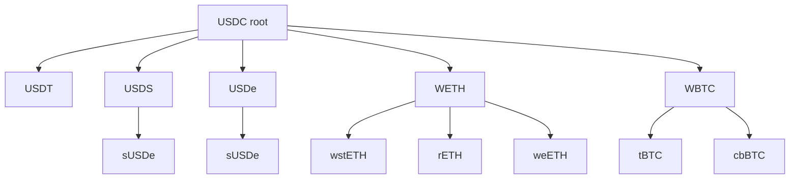

# Anchor Path Pricing

> Assets priced through anchor paths (lowest common ancestor routing) while accounted in base denomination (O(N) complexity, natural asset relationships)

## Problem: Hub-and-Spoke Limitations

**Issue 1: Volatility Misrepresentation**
- Trading correlated assets (wstETH→WETH) used √(σ_WETH/USDC × σ_wstETH/USDC) ≈ 49%
- Actual correlation only ~2% volatility

**Issue 2: Liquidity Profile Mismatch**
- Assets priced against USDC even when naturally trading against other assets
- wstETH liquidity should concentrate against WETH, not USDC

## Core Innovation: Tree-Based Routing

Assets form a tree where:
- **Root**: Base token (USDC, no anchor)
- **Each asset**: Has one anchor (parent node) defining pricing relationship
- **Swaps route**: Through anchor paths via lowest common ancestor (LCA)

**Result**: O(N) complexity + economically accurate pricing

### Graph Topology

**Constraints**:
- Maximum depth: 4 (root at 0, leaves at ≤4)
- Single root guarantees acyclicity
- Each asset: exactly one anchor
- Every asset: path to root

### Anchor Path Examples

| Route | Path | LCA | Hops |
|-------|------|-----|------|
| USDT→DAI | USDT → USDC → DAI | USDC | 2 |
| wstETH→WETH | wstETH → WETH | WETH | 1 |
| wstETH→rETH | wstETH → WETH → rETH | WETH | 2 |
| USDT→wstETH | USDT → USDC → WETH → wstETH | USDC | 3 |

**Max path**: 2×depth = 8 hops for depth-4 tree (capped at 6)

## Hop Semantics

Each hop has distinct behavior based on position in anchor path:

| Hop Type | Reserves | Pricing | Oracle | Purpose |
|----------|----------|---------|--------|---------|
| **Edge** (1st/last) | ✓ Change | Full impact | Required | Consume liquidity |
| **Intermediate** (middle) | ✗ Fixed | Mid-price only | Price only | Numeraire transform |

**Example** (USDT→wstETH via USDC→WETH):
1. USDT→USDC (edge): Price impact on both, reserve changes
2. USDC→WETH (intermediate): Mid-price only, no reserve change
3. WETH→wstETH (edge): Price impact on both, reserve changes

## Risk Aggregation

### Per-Hop Signals

**Volatility** (blend recent + baseline):

$$\sigma_i = (\sigma_{\text{fast},i} + \sigma_{\text{slow},i}) / 2$$

**Deviation** (multi-timeframe disagreement):

$$\begin{aligned} d_{\text{fs}} &= |o_{\text{fast},i} - o_{\text{slow},i}| \\ d_{\text{fc}} &= |o_{\text{fast},i}| \\ \Delta_i &= \max(d_{\text{fs}}, d_{\text{fc}}) \end{aligned}$$

### Path-Level Risk

Conservative max across all hops:

$$\begin{aligned} \sigma_{\text{pair}} &= \max_i(\sigma_i) \\ \Delta_{\text{pair}} &= \max_i(\Delta_i) \end{aligned}$$

**Rationale**: Path risk dominated by noisiest hop. If WETH (intermediate node) moves 10% during swap, trader bears that risk.

## Spread Calculation

Only **endpoint parameters** (where reserves change):

$$\nu_{\text{spread}} = \max(\nu_{\text{in}}, \nu_{\text{out}})$$

$$\lambda_{\text{spread}} = \max(\lambda_{\text{in}}, \lambda_{\text{out}})$$

**Volatility band** (symmetric):

$$S_{\text{vol}} = 100 + \sigma_{\text{pair}} \cdot \nu_{\text{spread}}$$

**Deviation surcharge** (toxic side only):

$$U = \Delta_{\text{pair}} \cdot \lambda_{\text{spread}}$$

[^1]: **Solidity implementation**: Uses same scaling as Spread & Fees. `scaledVol = (volatility * vega) / (100 * MULT_BASE)` where `MULT_BASE = 10000`, `surcharge = (deviation * lambda) / MULT_BASE`. See `LibPricing._calculatePathSpreadCached()`.

**Final spread**:

$$\text{spreadBps} = \begin{cases} S_{\text{vol}} & \text{if improves coverage} \\ S_{\text{vol}} + U & \text{otherwise} \end{cases}$$

Creates **asymmetric spreads**: coverage-improving trades pay volatility band (arb-friendly), coverage-worsening trades pay extra (toxic penalty).

See [Spread & Fees](1.1.4.%20Spread%20&%20Fees.md) for full model.

## Key Advantages

| Aspect | All-Pairs (Balancer-style) | Hub-and-Spoke | Anchor Tree | Benefit |
|--------|---------------------------|---------------|-------------|---------|
| **Pair / pool count** | $O(N^2)$ | $O(N)$ (one spoke per non-hub asset) | $O(N)$ (one edge per non-hub asset) | Linear deployment cost |
| **Quote complexity per swap** | $O(1)$ direct, $O(N)$ to optimise route | $O(1)$ per quote (always 2 hops: token → hub → token) | $O(\log N)$ LCA on balanced tree, $O(\text{depth})$ in general; bounded-depth (≤4) → $O(1)$ in practice | Constant-time quoting |
| **Volatility estimation** | $O(N^2)$ pairwise σ tracking | hub-pair σ + worst-of for cross | per-hop σ, path-level max | Accurate cross-asset risk |
| **Oracles** | $O(N^2)$ pair feeds (or all-vs-base) | $O(N)$ (asset/hub) | $O(N)$ (asset/anchor) | Linear oracle surface |
| **LP concentration** | Diluted across $N(N-1)/2$ pools | Concentrated at hub, but only hub-pairs benefit | Natural, asset-based - sub-trees aggregate flow | Market-aligned depth |

> Foundations [§9.3](../../../concepts/foundations.md) gives the high-level $O(N)$ deployment scaling. The table above refines this with per-quote complexity, which is what matters at swap time.

**Multiple peg pooling**: A single pool can include USD stablecoins (USDC anchor), ETH LSTs (WETH anchor), BTC wraps (WBTC anchor) and much more.

## Trade-offs

| Downside | Mitigation |
|----------|-----------|
| Routing complexity | LCA caching, precomputed paths |
| Higher gas (long paths) | Direct anchors preferred, depth limit |
| Anchor concentration risk | Circuit breakers, monitoring |
| Configuration complexity | Clear governance, phased rollout |

## Implementation Notes

### Oracle Requirements
Each non-root asset needs oracle in terms of its anchor:
- wstETH/WETH oracle
- USDT/USDC oracle
- WETH/USDC oracle

Internal TWAP oracles preferred (no external dependencies).

### State Updates
Only **edge assets** change balances:
- Input asset reserves: +volume
- Output asset reserves: -volume
- Intermediate anchors: unchanged

## Security

- **Oracle resistance**: Leaf manipulation affects mostly that asset based on reservation price; anchor manipulation affects subtree
- **Capital efficiency**: Liquidity profiles match price-action (stablecoins near parity, LSTs near staking ratio with negative skew)
- **Arbitrage**: Direct wstETH/WETH arbitrage without USDC friction

## Summary

Tree-based routing elegantly balances O(N) complexity with accurate market pricing:
- ✓ Correct spreads for correlated assets
- ✓ Multiple simultaneous peg groups
- ✓ Natural liquidity concentration
- ✓ Unified risk management in base denomination

Trade-offs manageable with caching, monitoring, and phased deployment.
