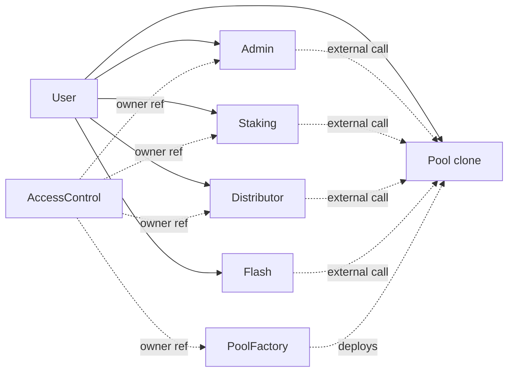
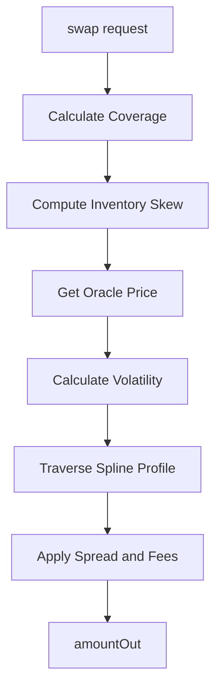
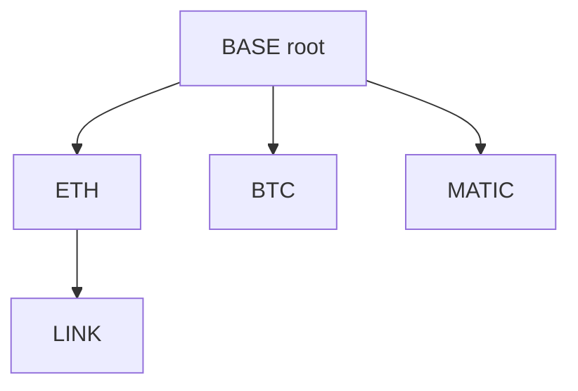
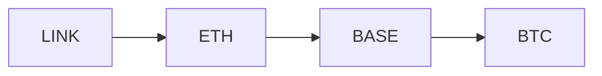

# AIMM System Architecture

> Technical overview of the Adaptive Inventory Market Maker protocol

> **Status: Phase 2.** BTR DEX ships after BTR Supply (ALM, Phase 1). On launch, BTR DEX becomes an additional adapter target alongside UniV3, UniV4, PancakeV3, PancakeInfinity, Algebra, Ramses in Supply vaults.

---

## 1. Overview

AIMM (Phase 2, not yet deployed) is a multi-asset AMM designed for passive liquidity providers. Core components:

- **Single-sided deposits** -LPs deposit one token, receive fungible LP tokens
- **N-asset pooling** -Anchor tree topology enables any-to-any routing
- **Inventory-based pricing** -Avellaneda-Stoikov inspired mid-price adjustment
- **Coverage-aware ALM** -Reserves/liabilities separation (Wombat-style)
- **Fritsch-Carlson monotone cubic Hermite spline profiles** -Algo-optimized, depth curves supporting non-uniform and multimodal distributions (Fritsch & Carlson 1980, *SIAM J. Numer. Anal.* 17(2))
- **Internal TWAP oracle** -Multi-timeframe (eg. 5min/1hr) with support for external fallback, inherited directly by `Pool` (no separate module)
- **Singleton contracts + EIP-1167 clones** -Each pool is a minimal-proxy clone of a single `Pool` impl. Governance / staking / rewards / flash are standalone singleton contracts shared across all pools.

---

## 2. Contract Architecture

### 2.1. Standalone Singletons + Pool Clones

Phase 42H removed the Diamond/proxy pattern. The protocol is now a small set of standalone singletons plus per-pool EIP-1167 clones:



**Properties:**
- No `delegatecall` between contracts. All cross-contract interactions are standard external calls.
- No ERC-7201 namespaced storage; each contract uses its own default storage layout.
- Each `Pool` clone holds its own `PoolStorage` at slot 0 (set once via `initialize`). Clones are non-upgradeable per-instance; the reference impl is replaceable via a 7-day timelocked swap at `PoolFactory`, which produces fresh clones rather than mutating live storage.
- Singletons (`Admin`, `Staking`, `Distributor`, `Flash`) are key-by-(pool, ...) so a single deployment serves every pool.
- Owner authority for every singleton routes through a single shared `AccessControl` singleton (one source of truth).

### 2.2. Core Contracts

| Contract | Path | Purpose |
|---|---|---|
| **[Pool](/docs/1.2.1-pool)** | `src/Pool.sol` | Swap, deposit, withdraw, donate, liability swap. Inherits internal TWAP oracle. |
| **[Admin](/docs/1.2.3-admin)** | `src/Admin.sol` | Per-pool timelocked configuration. |
| **[Staking](/docs/1.2.4-staking)** | `src/Staking.sol` | Governance + LP staking. |
| **[Distributor](/docs/1.2.5-distributor)** | `src/Distributor.sol` | Token-only campaign Merkle distribution. |
| **[Flash](/docs/1.2.6-flash)** | `src/Flash.sol` | ERC-3156 flash loans. |
| **PoolFactory** | `src/PoolFactory.sol` | Deploys EIP-1167 Pool clones, owns reference-impl swap timelock. |
| **AccessControl** | `@btr-shared/access/AccessControl.sol` | Single owner ref consumed by all singletons. |

---

## 3. Core Data Structures

Per-asset state includes reserves, liabilities, pricing parameters, and sensitivity coefficients. See `IPool.sol` for struct definitions.

**Key per-asset fields:**
- Reserves & liabilities for coverage tracking
- Anchor pointer for tree routing
- Sensitivity params: gamma, vega, lambda
- Fee bounds: minFeeBps, maxFeeBps

See: [Parametrization](/docs/1.1.7-Parametrization) for full field reference.

---

## 4. Pricing System

### 4.1. Pipeline



### 4.2. Key Concepts

- **Coverage Ratio**: `c = R / L` -measures asset health
- **Inventory Skew**: Linear Avellaneda-Stoikov adjustment (±100 range)
- **Spread**: Volatility-based fee with toxic flow surcharge
- **Spline Traversal**: Price impact via liquidity profile integration

See:
- [Inventory Management](/docs/1.1.1-inventory-management) -Coverage, skew, withdrawal haircuts
- [Spread & Fees](/docs/1.1.4-spread-fees) -Fee calculation
- [Liquidity Shaping](/docs/1.1.2-liquidity-shaping) -Spline profiles

---

## 5. Anchor Tree Routing

All tokens connect through an anchor tree with a hub token (typically stablecoin) as root.

### 5.1. Topology



### 5.2. Swap Routing (LCA Algorithm)

Swaps path through the Least Common Ancestor:



**Route**: `[LINK, ETH, BASE, BTC]`
**Hops**: `[LINK→ETH, ETH→BASE, BASE→BTC]`

**Constraints:**
- Max depth: 4
- Max path length: 6 hops (2 × MAX_DEPTH)
- No cycles allowed

See: [Anchor Path Pricing](/docs/1.1.3-anchor-path-pricing)

---

## 6. Oracle System

### 6.1. Internal Oracle

Auto-updated on every swap with:
- **Dual TWAP windows**: Fast (5min) + Slow (1hr)
- **Dual volatility EMAs**: Responsive + Stable
- **B64 encoding**: Compact 64-bit price storage

See: [Internal Oracle](/docs/1.2.2-internal-oracle) for full details.

### 6.2. Gas Optimization

Oracle reads are cached in transient storage (EIP-1153):
- First read: ~2,100 gas (external call)
- Subsequent reads: ~100 gas (transient load)

---

## 7. Coverage-Aware ALM

Asset-Liability Management (ALM) tracks reserves vs LP claims per asset:

- **Coverage Ratio**: `c = R / L` (100% = equilibrium)
- **Undercollateralized** (`c < 100%`): Withdrawal haircuts apply
- **Overcollateralized** (`c > 100%`): Surplus available

**Safety Mechanisms:**
- Withdrawal haircuts protect remaining LPs when `c < 100%`
- Liability decay gradually restores coverage in emergencies

See: [Inventory Management](/docs/1.1.1-inventory-management) for formulas and details.

---

## 8. Liquidity Profiles

Fritsch-Carlson monotone cubic Hermite spline profiles define liquidity distribution across the depth curve:

- **1-16 weight segments** with monotone cubic interpolation
- **Exact analytical integration** for price impact calculation
- **Customizable shapes**: Concentrated, uniform, multimodal

See: [Liquidity Shaping](/docs/1.1.2-liquidity-shaping) for profile design and examples.

---

## 9. Storage Layout

### 9.1. Per-Contract Layouts

Each singleton uses default Solidity storage (no ERC-7201 namespacing). Cross-pool keying is handled via `mapping(address pool => ...)` at the storage root.

| Contract | Layout | Purpose |
|---|---|---|
| `Pool` (clone) | `PoolStorage` at slot 0 | Per-clone assets, reserves, config -set once via `initialize`. Append-only field order across reference-impl upgrades. |
| `Admin` | `pendingOps[keccak256(pool, opId)]`, `pendingData[...]` | Per-pool timelock queue. |
| `Staking` | `mapping(pool, ...)` per-user and per-LP-token | Stakes, voting power. |
| `Distributor` | `mapping(pool, campaignId, ...)` | Campaigns + cumulative claims. |
| `Flash` | none (reads pool state) | Stateless. |

### 9.2. Transient Storage (EIP-1153)

Used for:
- Reentrancy guards
- Oracle price caching (~2,100 gas/hit saved)
- Flash loan state

---

## 10. Governance & Timelocks

### 10.1. Operation Types

| OpType | Delay | Risk Level |
|--------|-------|------------|
| TRANSFER_OWNERSHIP | 3 days | HIGH |
| UPGRADE_POOL_IMPL (factory) | 7 days | CRITICAL |
| MIGRATE_BASE_TOKEN | 7 days | CRITICAL |
| UPDATE_ORACLE | 2 days | BASE |
| ADD_ASSET | 1 day | LOW |
| UPDATE_FEES | 1 day | LOW |

### 10.2. Two-Phase Execution

1. `requestOperation(data)` → stores pending
2. Wait for delay
3. `executeOperation()` → applies within grace period

---

## 11. Key Invariants

### 11.1. Coverage Bounds

`c in [0, oo)`

- `c = 1.0` → equilibrium
- `c < 1.0` → undercollateralized (haircuts apply)
- `c > 1.0` → overcollateralized

### 11.2. Skew Bounds

`-100 <= "skew" <= +100`

### 11.3. Fee Bounds

`"minFeeBps" <= "totalFee" <= "maxFeeBps"`

Where fees use 0.0001% precision (BPS_PRECISION = 1,000,000).

### 11.4. Anchor Tree

```
maxDepth ≤ 4
maxPathLength ≤ 6
noCycles = true
```

---

## 12. Gas Optimizations

| Optimization | Savings |
|--------------|---------|
| Single-slot FeedData packing | ~2,100 gas/read |
| B64 encoding | 75% storage reduction |
| Transient oracle caching | ~2,100 gas/hit |
| Packed timelocks | 66% slot reduction |
| LCA without path caching | Storage-free routing |
| Bitmask hooks | 32 bits vs N mappings |

---

## 13. Error Handling

Minimal consolidated error set:

| Error | Usage |
|-------|-------|
| `ZeroValue()` | Zero address/amount/price |
| `InsufficientAmount(available, required)` | Balance checks |
| `ExcessiveAmount(amount, limit)` | Limit exceeded |
| `InvalidState()` | Not initialized/paused |
| `FeatureDisabled(resource)` | Swap/flash disabled |
| `NotConfigured(resource, target)` | Missing config |
| `ThresholdViolation(value, threshold)` | Slippage/coverage |
| `StaleData(age, maxAge)` | Oracle staleness |
| `ReentrancyDetected()` | Guard triggered |

See: `contracts/src/interfaces/IErrors.sol`

---

## 14. Contract Deployment

### 14.1. Immutable Components

- All AIMM library contracts (Pricing, PoolOracle, Spline, Maths, AnchorTree, etc.)
- `Pool` clones (per-instance immutable -non-upgradeable post-deploy)
- Singleton contracts: `Admin`, `Staking`, `Distributor`, `Flash` (new deployment for any change)

### 14.2. Replaceable via Factory Timelock

- `Pool` reference impl -swappable via 7-day timelock at `PoolFactory`. New clones use the new impl; existing clones continue running their original impl.

### 14.3. Upgradeable via UUPS

- Treasury
- Bridge (LayerZero v2 OApp endpoint)
- AccessControl (shared singleton)

---

## 15. Related Documentation

- [Inventory Management](/docs/1.1.1-inventory-management) -Pricing mechanics
- [Pool Contract](/docs/1.2.1-pool) -Module documentation
- [Parametrization](/docs/1.1.7-parametrization) -Parameter reference
