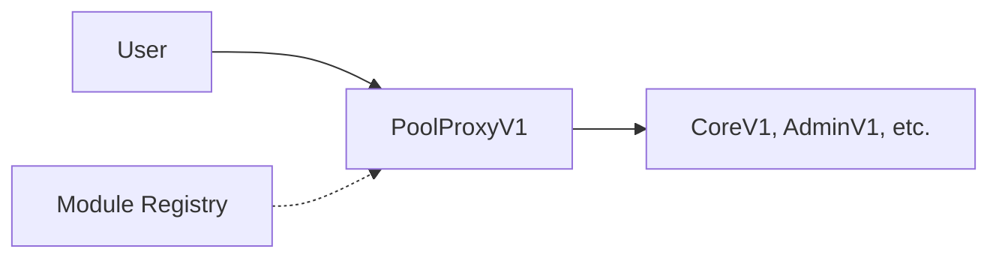
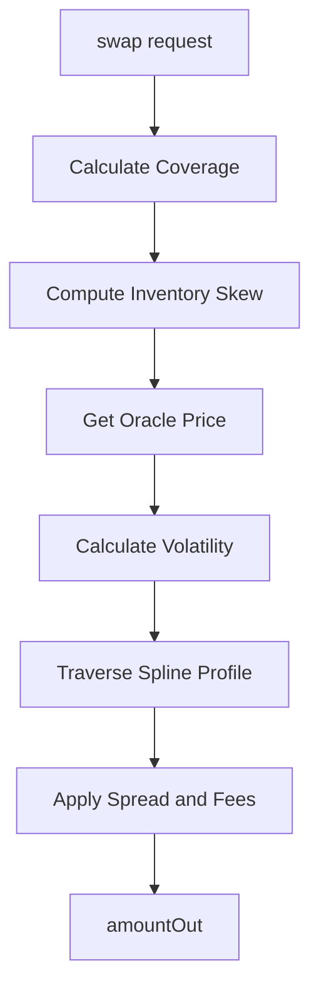
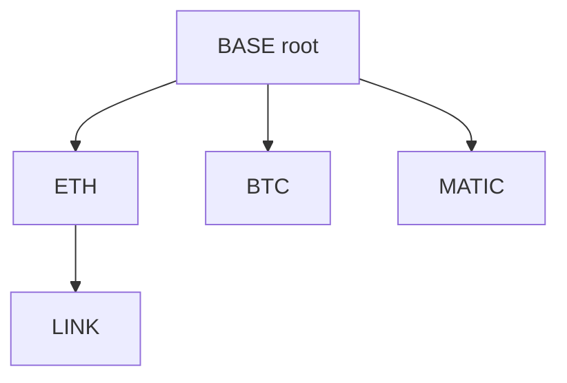

# AIMM System Architecture

> Technical overview of the Adaptive Inventory Market Maker protocol

---

## 1. Overview

AIMM is a multi-asset AMM designed for passive liquidity providers. Core components:

- **Single-sided deposits** — LPs deposit one token, receive fungible LP tokens
- **N-asset pooling** — Anchor tree topology enables any-to-any routing
- **Inventory-based pricing** — Avellaneda-Stoikov inspired mid-price adjustment
- **Coverage-aware ALM** — Reserves/liabilities separation (Wombat-style)
- **Catmull-Rom spline profiles** — Algo-optimized, depth curves supporting non-uniform and multimodal distributions
- **Internal TWAP oracle** — Multi-timeframe (eg. 5min/1hr) with support for external fallback
- **Diamond-lite proxy** — Modular module upgrades via ERC-7201 namespaced storage

---

## 2. Contract Architecture

### 2.1. Diamond-Lite Proxy (PoolProxyV1)

All pool interactions route through a single proxy that dispatches to implementation modules via `delegatecall`:



**Storage Isolation**: Each module uses [ERC-7201](https://eips.ethereum.org/EIPS/eip-7201) namespaced storage to prevent collisions.

### 2.2. Core Modules

| Module | Purpose | Key Functions |
|--------|---------|---------------|
| **[CoreV1](/docs/1.2.1-core)** | Main AMM operations | `swap`, `deposit`, `withdraw`, `liabilitySwap`, `donate` |
| **[InternalOracleV1](/docs/1.2.2-internal-oracle)** | TWAP tracking | Auto-updated on swaps, dual-window EMAs |
| **[AdminV1](/docs/1.2.3-admin)** | Configuration | Asset management, fee params, timelocks |
| **[FlashV1](/docs/1.2.6-flash)** | Flash loans | ERC-3156 compliant |
| **[StakingV1](/docs/1.2.4-staking)** | Governance staking | LP + gov token staking, voting power |
| **[DistributorV1](/docs/1.2.5-distributor)** | Rewards | Accumulator-based distribution |
| **[RescueV1](/docs/1.2.7-rescue)** | Emergency | Token rescue, admin recovery |

---

## 3. Core Data Structures

Per-asset state includes reserves, liabilities, pricing parameters, and sensitivity coefficients. See `IPoolV1.sol` for struct definitions.

**Key per-asset fields:**
- Reserves & liabilities for coverage tracking
- Anchor pointer for tree routing
- Sensitivity params: gamma, vega, lambda
- Fee bounds: minFeeBps, maxFeeBps

See: [Parametrization](/docs/1.1.7-Parametrization) for full field reference.

---

## 4. Pricing System

### 4.1. Pipeline



### 4.2. Key Concepts

- **Coverage Ratio**: `c = R / L` — measures asset health
- **Inventory Skew**: Linear Avellaneda-Stoikov adjustment (±100 range)
- **Spread**: Volatility-based fee with toxic flow surcharge
- **Spline Traversal**: Price impact via liquidity profile integration

See:
- [Inventory Management](/docs/1.1.1-inventory-management) — Coverage, skew, withdrawal haircuts
- [Spread & Fees](/docs/1.1.4-spread-fees) — Fee calculation
- [Liquidity Shaping](/docs/1.1.2-liquidity-shaping) — Spline profiles

---

## 5. Anchor Tree Routing

All tokens connect through an anchor tree with a hub token (typically stablecoin) as root.

### 5.1. Topology



### 5.2. Swap Routing (LCA Algorithm)

Swaps path through the Least Common Ancestor:


**Route**: `[LINK, ETH, BASE, BTC]`
**Hops**: `[LINK→ETH, ETH→BASE, BASE→BTC]`

**Constraints:**
- Max depth: 4
- Max path length: 6 hops (2 × MAX_DEPTH)
- No cycles allowed

See: [Anchor Path Pricing](/docs/1.1.3-anchor-path-pricing)

---

## 6. Oracle System

### 6.1. Internal Oracle

Auto-updated on every swap with:
- **Dual TWAP windows**: Fast (5min) + Slow (1hr)
- **Dual volatility EMAs**: Responsive + Stable
- **B64 encoding**: Compact 64-bit price storage

See: [Internal Oracle](/docs/1.2.2-internal-oracle) for full details.

### 6.2. Gas Optimization

Oracle reads are cached in transient storage (EIP-1153):
- First read: ~2,100 gas (external call)
- Subsequent reads: ~100 gas (transient load)

---

## 7. Coverage-Aware ALM

Asset-Liability Management (ALM) tracks reserves vs LP claims per asset:

- **Coverage Ratio**: `c = R / L` (100% = equilibrium)
- **Undercollateralized** (`c < 100%`): Withdrawal haircuts apply
- **Overcollateralized** (`c > 100%`): Surplus available

**Safety Mechanisms:**
- Withdrawal haircuts protect remaining LPs when `c < 100%`
- Liability decay gradually restores coverage in emergencies

See: [Inventory Management](/docs/1.1.1-inventory-management) for formulas and details.

---

## 8. Liquidity Profiles

Catmull-Rom spline profiles define liquidity distribution across the depth curve:

- **1-16 weight segments** with monotone cubic interpolation
- **Exact analytical integration** for price impact calculation
- **Customizable shapes**: Concentrated, uniform, multimodal

See: [Liquidity Shaping](/docs/1.1.2-liquidity-shaping) for profile design and examples.

---

## 9. Storage Layout (ERC-7201)

### 9.1. Namespaced Slots

| Module | Location | Purpose |
|--------|----------|---------|
| Core | `CORE_STORAGE_LOC` | Assets, balances, config |
| Oracle | `ORACLE_STORAGE_LOC` | Feed accumulators |
| Staking | `STAKING_STORAGE_LOC` | Stakes, voting power |
| Distributor | `DISTRIBUTOR_STORAGE_LOC` | Campaigns, rewards |

### 9.2. Transient Storage (EIP-1153)

Used for:
- Reentrancy guards
- Oracle price caching (~2,100 gas/hit saved)
- Flash loan state

---

## 10. Governance & Timelocks

### 10.1. Operation Types

| OpType | Delay | Risk Level |
|--------|-------|------------|
| TRANSFER_OWNERSHIP | 3 days | HIGH |
| UPDATE_MODULE | 2 days | BASE |
| MIGRATE_BASE_TOKEN | 7 days | CRITICAL |
| UPDATE_ORACLE | 2 days | BASE |
| ADD_ASSET | 1 day | LOW |
| UPDATE_FEES | 1 day | LOW |

### 10.2. Two-Phase Execution

1. `requestOperation(data)` → stores pending
2. Wait for delay
3. `executeOperation()` → applies within grace period

---

## 11. Key Invariants

### 11.1. Coverage Bounds

`c in [0, oo)`

- `c = 1.0` → equilibrium
- `c < 1.0` → undercollateralized (haircuts apply)
- `c > 1.0` → overcollateralized

### 11.2. Skew Bounds

`-100 <= "skew" <= +100`

### 11.3. Fee Bounds

`"minFeeBps" <= "totalFee" <= "maxFeeBps"`

Where fees use 0.0001% precision (BPS_PRECISION = 1,000,000).

### 11.4. Anchor Tree

```
maxDepth ≤ 4
maxPathLength ≤ 6
noCycles = true
```

---

## 12. Gas Optimizations

| Optimization | Savings |
|--------------|---------|
| Single-slot FeedData packing | ~2,100 gas/read |
| B64 encoding | 75% storage reduction |
| Transient oracle caching | ~2,100 gas/hit |
| Packed timelocks | 66% slot reduction |
| LCA without path caching | Storage-free routing |
| Bitmask hooks | 32 bits vs N mappings |

---

## 13. Error Handling

Minimal consolidated error set:

| Error | Usage |
|-------|-------|
| `ZeroValue()` | Zero address/amount/price |
| `InsufficientAmount(available, required)` | Balance checks |
| `ExcessiveAmount(amount, limit)` | Limit exceeded |
| `InvalidState()` | Not initialized/paused |
| `FeatureDisabled(resource)` | Swap/flash disabled |
| `NotConfigured(resource, target)` | Missing config |
| `ThresholdViolation(value, threshold)` | Slippage/coverage |
| `StaleData(age, maxAge)` | Oracle staleness |
| `ReentrancyDetected()` | Guard triggered |

See: `contracts/src/interfaces/IErrors.sol`

---

## 14. Contract Deployment

### 14.1. Immutable Components

- Library contracts (LibPricing, LibOracle, LibSpline, LibMaths)
- Factory contracts

### 14.2. Upgradeable via Proxy

- PoolProxyV1 (dispatcher)
- All modules (CoreV1, AdminV1, etc.)

### 14.3. Upgradeable via UUPS

- TreasuryV1
- BridgeV1

---

## 15. Related Documentation

- [Inventory Management](/docs/1.1.1-inventory-management) — Pricing mechanics
- [Core Module](/docs/1.2.1-core) — Module documentation
- [Parametrization](/docs/1.1.7-parametrization) — Parameter reference
