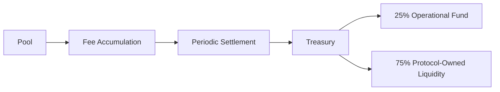

# DAO Treasury

> Protocol-wide fund management with governance-controlled spending and strict supply enforcement

---

## 1. Overview

The **DAO Treasury** (`TreasuryV1`) is a smart contract responsible for:

- **Token emission management**: Controls total BTR supply and emission schedule
- **Vesting administration**: Manages team, advisor, and contributor vesting schedules
- **Protocol fee collection**: Receives and stores trading fees from all pools
- **Strategic spending**: Treasury allocations for grants, partnerships, and operations (governance-approved)
- **Supply cap enforcement**: Hard-coded 100M BTR maximum supply with no increase possible without supermajority governance

**Key principle**: Treasury is **owned by DAO governance multisigs**, which execute decisions approved by BTR token holders through governance voting.

---

## 2. Multisig Architecture

The DAO uses **three specialized multisig wallets** following industry best practices:

> **Council** = BTR Admin multisig (2-of-3 at launch, scaling to 4-of-7 at maturity). Controls contract upgrades, parameter changes, and timelock execution.

### 2.1. Multisig Overview

| Wallet | Purpose | Threshold (Launch) | Speed | Security |
|--------|---------|-------------------|-------|----------|
| **BTR Treasury** | Fund custody | 2-of-3 | Low | High |
| **BTR Admin (Council)** | Contract upgrades + parameters | 2-of-3 + Timelock | Low | High |
| **BTR Guardian** | Emergency pause | 1-of-n | High | Medium |

### 2.2. BTR Treasury Safe

**Purpose**: Custody and spending of protocol funds

**Signers (Launch)**:
- 2 co-founders (designated treasurers)
- 1 trusted third party (e.g., advisor or auditor)

**Threshold**: 2-of-3
- Prevents theft (requires 2 signers to move funds)
- Recovers from lost keys (any 2 signers can execute)

**Operations**:
- Fund transfers to contractors, partners
- BTR buybacks and POL investment
- Grant distributions

### 2.3. BTR Admin Safe (Council)

**Purpose**: Contract administration with timelock protection

**Signers (Launch)**:
- 2 co-founders
- 1 trusted third party (auditor or legal)

**Threshold**: 2-of-3

**Operations**:
- Contract upgrades (UUPS proxy admin owner)
- Parameter changes (fees, risk limits, emission routing)
- Timelock owner (queues and executes delayed operations)
- Veto pending timelock operations if malicious

**Timelock**: 7-day delay on all critical operations
- Community can exit during delay if proposal is adversarial
- Admin can cancel queued ops (2-of-3 agreement)

### 2.4. BTR Guardian Safe

**Purpose**: Emergency response — speed prioritized

**Signers (Launch)**:
- 2 co-founders
- 1+ trusted third parties (auditors, security partners)

**Threshold**: 1-of-n
- Any signer can pause unilaterally during active exploit
- Speed matters in emergency; deliberation can happen post-pause

**Operations**:
- `pause()` on all pool modules
- `freezeAsset(token)` for compromised tokens
- Emergency bridge pause

**Cannot**:
- Move funds
- Upgrade contracts
- Change parameters

### 2.5. Multisig Evolution Path

| Stage | Treasury Quorum | Admin Quorum | Guardian Threshold | Rationale |
|-------|-----------------|--------------|-------------------|-----------|
| **Launch (Now)** | 2-of-3 | 2-of-3 | 1-of-3 | Speed; trust concentrated in founders |
| **Growth (5+ trusted)** | 3-of-5 | 3-of-5 | 1-of-5 | Removes founder dictatorship; 2 absent signers OK |
| **Mature (DAO)** | 4-of-7 | 4-of-7 | 1-of-7 | Maximizes decentralization; broad consensus |

**Decentralization milestones**:
- Co-founders can opt-out as more community members are elected
- Council elected by governance vote (annual or on-demand)
- Guardian signers: security partners, auditors, community delegates

---

## 2.6. Spending Authorities

**Approval-required spending** (> 200k BTR):
- Requires on-chain governance vote (Snapshot)
- 7-day timelock before execution
- Supermajority (67%) for protocol-critical allocations

**Delegated spending** (≤ 200k BTR per transaction):
- Treasury multisig can execute without additional vote
- Includes monthly operational budgets, small grants
- Subject to annual DAO review and adjustment

**Restricted categories**:
- Any single transfer must not exceed 5% of treasury balance
- Monthly spending capped at 2% of total supply
- Annual spending capped at 8% of total supply

---

## 3. Revenue Sources

### 3.1. Protocol Fee Collection

**Fee streams**:
- **Trading fees**: Collected from each pool's swap transactions
- **Flash loan fees**: 0.009% (9 basis points) per borrowed amount (see [Flash Loans](/docs/1.2.6-Flash))
- **Withdrawal haircuts**: Coverage-dependent fees on low-collateral withdrawals (see [Inventory Management §2](/docs/1.1.1-Inventory-Management#2-coverage-ratio))

**Flow**:



**Settlement frequency**: Weekly or monthly (DAO-configurable)

### 3.2. Protocol-Owned Liquidity (POL)

The treasury can deploy collected fees into liquidity positions:

- **Primary pairs**: BTR/ETH, BTR/USDC, BTR/stables
- **Auto-compounding**: LP fees are re-invested (no additional cost to treasury)
- **Liquidity support**: Prevents BTR price volatility, maintains trading depth
- **Exit strategy**: POL can be unwound if treasury needs emergency capital

---

## 4. Treasury Allocations

### 4.1. Initial Allocation (at TGE)

From 20M BTR total treasury:

| Purpose | Amount | % | Description |
|---------|--------|---|-------------|
| **Ecosystem Grants** | 3-5M BTR | 15-25% | Developer integrations, partnerships |
| **Protocol-Owned Liquidity** | 5-8M BTR | 25-40% | Initial seeding + ongoing investment |
| **Operations & Marketing** | 2-3M BTR | 10-15% | Events, audits, hiring, selective campaigns |
| **Emergency Reserves** | 3-5M BTR | 15-25% | Exploit response, black swan coverage |
| **Unallocated** | 2-4M BTR | 10-20% | Held for strategic opportunities |

### 4.2. Ongoing Annual Budgets

**Example Year 1 budget** (governance-approved):

```
Total treasury: ~18-20M BTR (after initial allocations)
Annual spend cap: ~1.6-1.8M BTR (8% of supply)

Proposed allocation:
- Ecosystem development: 400-500k BTR
- POL investment/rebalancing: 300-400k BTR
- Core infrastructure: 200-300k BTR
- Marketing & partnerships: 200-300k BTR
- Contingency/growth fund: 200-300k BTR
```

**Governance process**:
1. Council proposes annual budget (Q4 of previous year)
2. Community discussion (1 week)
3. Snapshot vote (7 days)
4. Execute via timelock (7-day delay)

---

## 5. Vesting & Claims

### 5.1. Team Vesting Administration

Treasury manages on-chain vesting for:
- **Founders**: 12M BTR allocated, 5-year vest, 6-month cliff, 15% unlock
- **Contributors**: Allocated pro-rata from team allocation pool
- **Advisors**: Smaller allocations, 3-year vest (optional)

**Vesting schedule** (immutable):
- Month 0-6: No claimable tokens (cliff period)
- Month 6: 15% claimable (1.8M BTR total for all team)
- Months 7-60: Linear vesting of remaining 85%
- Month 60+: All tokens fully vested

**Auto-staking option**: Team members can configure vesting to auto-stake all claimable BTR into sBTR, earning staking rewards during vesting period.

### 5.2. Emissions Vesting

Emissions (65M BTR over ~10 years) are treated as a vesting schedule:

- **Emissions cap**: 65M BTR total (hard-coded in contract)
- **Claimed amount**: Tracks how much has been minted to distributor
- **Governance control**: Can adjust emission schedule parameters (within bounds) via vote

---

## 6. Supply Cap & Inflation Control

### 6.1. Hard-Coded Maximum Supply

```solidity
maxSupply = 100,000,000 BTR (immutable after TGE)
```

**Safety guarantee**: No function can mint tokens beyond `maxSupply`. Verification on every mint:

```solidity
if (totalSupply + amount > maxSupply) revert ExceedsMaxSupply();
```

**Impossibility of increase**: Supply cap cannot be increased without:
1. Governance supermajority (67%+) vote
2. New smart contract deployment (current contract cannot be modified)
3. Complete migration (extremely contentious, unlikely to pass)

### 6.2. Supply Breakdown

| Category | BTR Amount | % of 100M | Status |
|----------|-----------|----------|--------|
| **Emissions** | 65M | 65% | Subject to halving curve |
| **Treasury** | 20M | 20% | Subject to governance spending |
| **Team & Advisors** | 12M | 12% | Subject to vesting schedule |
| **Liquidity Bootstrapping Pool** | 3M | 3% | Minted at TGE for LBP auction |
| **TOTAL** | 100M | 100% | Hard-coded maximum |

---

## 7. Emissions Management

### 7.1. Emission Caps & Scheduling

**Total emissions cap**: 65M BTR

**Claimed tracking**:
- Distributor module mints emissions on-demand
- Treasury tracks `emissionsClaimed` against `emissionsCap`
- No emissions can be minted once cap is reached

**Schedule parameters** (governance-adjustable within bounds):

| Parameter | Current | Min | Max | Adjustable |
|-----------|---------|-----|-----|-----------|
| **E₀** (base rate) | ~62,500 BTR/week | 50k/week | 80k/week | Yes |
| **Halving interval** | ~104 weeks (2yr) | 78 weeks | 156 weeks | Yes |
| **Halving factor** | 0.5x | 0.4x | 0.6x | Yes |

**Adjustment process**:
1. Council proposes emission parameter change
2. Community discussion (48-72 hours)
3. Snapshot vote (7 days)
4. Timelock execution (7 days)
5. New emission curve takes effect

### 7.2. Emission Routing

Of 65M BTR emissions:

| Recipient | % | BTR Amount | Purpose |
|-----------|---|-----------|---------|
| **sLP holders** | 90% | 58.5M BTR | Per-asset incentive farming |
| **sBTR stakers** | 5% | 3.25M BTR | Pure governance incentives |
| **Emissions Treasury** | 5% | 3.25M BTR | Airdrops, campaigns, discretionary |

**Routing update**: Can be adjusted via governance vote (within 80-95% / 2-10% / 3-10% ranges)

---

## 8. Governance & Oversight

### 8.1. Treasury Spending Governance

**All treasury operations are logged on-chain**:
- Vesting claims (time-locked, automatic)
- Emissions mints (tracked via distributor)
- Protocol fee collection (recorded per pool)
- Treasury transfers (require multisig execution + governance approval for large amounts)


### 8.2. Governance Thresholds

| Action | Approval Threshold | Timelock | Notes |
|--------|-------------------|----------|-------|
| **Monthly spending** | Council only | None | Capped at 2% of supply |
| **Treasury allocation** | Simple majority (50%+) | 7 days | Typical grants, partnerships |
| **Emission parameter change** | Simple majority (50%+) | 7 days | E₀, halving interval, halving factor |
| **Emission routing change** | Simple majority (50%+) | 7 days | sLP/sBTR/treasury split |
| **Supply cap change** | Supermajority (67%+) | 7 days + 7 day grace | Effectively impossible |
| **Treasury ownership transfer** | Supermajority (67%+) | 7 days | Transition to full DAO |

---

## 9. Emergency Procedures

### 9.1. Pause Mechanism

If critical vulnerability is discovered:

1. **Immediate pause**: Owner can pause all pools without timelock
2. **Reason disclosure**: Must publish technical report within 24 hours
3. **Community review**: 7 days for discussion and community response
4. **Vote to unpause**: Governance vote required to resume operations

### 9.2. Rescue Mode

If treasury itself is compromised:

1. **Multisig emergency execution**: Council can trigger emergency backup
2. **Asset recovery**: Remaining treasury moved to secure multisig
3. **Vote for new governance**: Community votes on replacement governance structure

---

## 10. Code References

### 10.1. Contract Location & Functions

**Contract**: `TreasuryV1.sol`

Key functions:
- `initializeEmissions(uint256 _emissionsCap)` — Set emission cap
- `mintGovToken(address to, uint256 amount)` — Mint for grants/operations
- `mintEmissionsToDistributor(uint256 amount)` — Mint emissions (checked against cap)
- `requestOwnershipTransfer(address newOwner)` — Initiate ownership transfer (7-day timelock)
- `executeOwnershipTransfer()` — Execute delayed ownership transfer
- `requestEmissionsCap(uint256 newCap)` — Change emission cap (7-day timelock)
- `executeEmissionsCap()` — Execute delayed cap change

### 10.2. Related Contracts

- **Distributor**: Receives emissions, distributes to liquidity providers
- **Staking Module**: Manages sBTR staking and governance voting power
- **Pool Proxy**: Collects and forwards protocol fees to treasury
- **Bridge**: Relays cross-chain LP token bridging (see `BridgeV1.sol`)

---

## 11. Related Documentation

- [Governance Overview](/docs/overview-governance) — Tokenomics and allocation structure
- [Voting](/docs/2.2-DAO-Voting) — Governance voting mechanics
- [Emission Control](/docs/2.5-Emission-Control) — Detailed emission scheduling
- [Liquid Staking](/docs/2.4-Liquid-Staking) — sBTR staking rewards

---

## References

- ERC-20: [Ethereum Token Standard](https://eips.ethereum.org/EIPS/eip-20)
