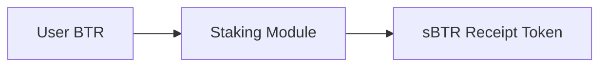
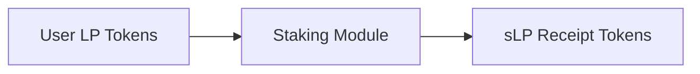
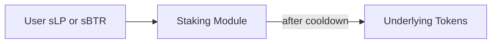

# Liquid Staking

> Governance token and LP token staking with voting power, rewards, and timelocked exit

---

## 1. Overview

**Liquid staking** in AIMM enables users to:

- **Lock BTR** to earn voting power (sBTR receipt token)
- **Delegate voting rights** to governance participants
- **Earn staking rewards** from emissions pool (5% of total emissions)
- **Stake LP tokens** to be eligible for liquidity provider rewards (90% of emissions)
- **Manage cooldowns** on unstaking to prevent flash-loan voting attacks

The system uses **receipt tokens** (sBTR for BTR, sLP per pool for LP tokens) to represent staked positions, enabling delegation and clear accounting.

---

## 2. BTR Staking (sBTR)

### 2.1. Staking Mechanics

**Stake action**:



**Receipt token** (sBTR):
- ERC-20 token representing staked BTR
- **Fully transferable and fungible** (major differentiator vs veCRV/veAERO)
- Can be delegated, traded on DEXs, or used in other DeFi protocols
- Accumulates staking rewards (rebase mechanism optional)
- Voting power determinant at governance snapshot block

> **Key differentiator**: Unlike veCRV (non-transferable) or veAERO (NFT, non-fungible), sBTR is a standard ERC-20 that can be freely transferred. See [BTR Token §4.1](/docs/2.1-BTR-Token#41-liquid-staked-tokens) for comparison.

### 2.2. Rewards & APR

**Reward source**: 5% of total emissions (3.25M BTR over 10 years)

**Distribution mechanism**:
- **Accumulator pattern** (O(1) per claim): Similar to Aave's reward system
- **Per-block minting**: Emissions accrued continuously, claimed on-demand
- **Pro-rata distribution**: APR = (Annual emissions × 5%) / (Total sBTR market cap)

**Example APR calculation** (Year 1):
```
Annual sBTR emissions: 3,250,000 BTR
Assume sBTR staked: ~5M BTR (5% of supply staking)
APR = 3.25M / 5M = 65% APY (first year, decreases with halving curve)
```

**Claim frequency**: Users can claim anytime (no minimum lock period after initial stake)

### 2.3. Voting Power Derivation

sBTR holders' voting power is calculated at governance snapshot block:

$$V_{\text{btr}} = \frac{\text{sBTR}_{\text{balance}} \cdot \text{btr}_{\text{price}} \cdot \text{govMultiplier}}{10000}$$

where:
- $\text{govMultiplier}$ = 10000 (default, meaning 1x weight)
- $\text{btr}_{\text{price}}$ = price of BTR at snapshot block

> **Note**: This is the linear component. For complete formula including quadratic damping, see [DAO Voting §2.2-2.3](/docs/2.2-DAO-Voting#22-quadratic-damping).

**Delegation**:
```solidity
staking.delegateVoting(delegate_address)
```

All voting power delegates to specified address for snapshot voting. Revoked via:
```solidity
staking.delegateVoting(msg.sender)  // Self-delegate, regain voting power
```

---

## 3. LP Token Staking (sLP)

### 3.1. Staking LP Tokens

Each AIMM pool has an associated **LP token** (ERC-20, minted on deposit).

**Stake action** (per pool):



**sLP properties**:
- One sLP token per pool (e.g., sLP_ETH/USDC, sLP_WBTC/USDC)
- Represents staked LP position, accrues rewards
- **Fully transferable and fungible** (like sBTR -a key differentiator vs competitors)
- Can be delegated, traded, or used as collateral in other protocols
- Non-rebasing (balances don't change, only value increases via reward accumulation)
- Bridgeable cross-chain via `Bridge` (see [Bridge.sol](/contracts/src/Bridge.sol))

### 3.2. Liquidity Provider Rewards

**Reward source**: 90% of total emissions (58.5M BTR over 10 years)

**Allocation formula** (per pool, per asset):

$$R_{\text{asset}} = E_{\text{sLP}} \cdot w_{\text{pool}} \cdot w_{\text{asset}}$$

where:
- $R_{\text{asset}}$ = reward allocated to the asset
- $E_{\text{sLP}}$ = total sLP emissions
- $w_{\text{pool}} \propto \text{TVL}_{\text{pool}} / \text{TVL}_{\text{total}}$
- $w_{\text{asset}} \propto (\text{coverage} \cdot \text{utilization})_{\text{asset}}$

**Coverage weighting** (see [Inventory Management §2](/docs/1.1.1-Inventory-Management#2-coverage-ratio)):
- **100% coverage**: 1.0x weight (ideal)
- **< 100% coverage**: Reduced weight (encourages rebalancing)
- **> 100% coverage**: Reduced weight (less risk = lower incentive)

**Utilization weighting**:
- **Low utilization** (0-20%): Reduced weight
- **Optimal utilization** (50-80%): Maximum weight (1.0x)
- **High utilization** (> 90%): Reduced weight (risk management)

**Claim frequency**: Same as BTR staking (accumulator pattern, on-demand claims)

### 3.3. Multi-Pool LP Staking

Users can stake LP tokens from multiple pools simultaneously:

```
User portfolio:
- 100 sLP_ETH/USDC (earning emissions from ETH/USDC pool)
- 50 sLP_WBTC/USDC (earning emissions from WBTC/USDC pool)
- 25 sLP_stETH/ETH (earning emissions from stETH/ETH pool)

Total staked LP value: ≈ sum of all sLP positions at current prices
```

Each pool's emissions are independent (no competition between pools).

---

## 4. Unstaking & Cooldowns

### 4.1. Unstaking Mechanics

**Unstake action** (burns receipt token):



**Two-phase process**:

1. **Request unstake** (immediate):
   - User calls `unstake(amount)` in staking module
   - Receipt tokens burned, cooldown timer starts
   - User cannot use these tokens during cooldown

2. **Execute unstake** (after cooldown):
   - User calls `claimUnstaked()` after cooldown period expires
   - Underlying tokens transferred to user
   - Cooldown timer cleared

**Cooldown duration**: 2 weeks (configurable by governance)

### 4.2. Rationale for Cooldowns

**Flash-loan attack prevention**:
- Users can't stake in block N, vote in block N+1, unstake in block N+2
- Cooldown ensures committed participation (can't exit before vote execution)

**Governance finality**:
- Vote passes → 7-day timelock → Execution
- Cooldown ensures users who voted remain exposed to consequences

### 4.3. Pending Unstakes

Users can have multiple pending unstakes (e.g., unstake 10 sBTR on day 1, unstake 20 more on day 5):

Each unstake is tracked separately and matures independently.

**Pending Unstakes Example Timeline:**

| Unstake | Start Date | Cooldown Period | Claim Available |
|----------|------------|----------------|------------------|
| Unstake 1 (10 sBTR) | 2024-01-01 | 14 days | 2024-01-15 |
| Unstake 2 (20 sBTR) | 2024-01-05 | 14 days | 2024-01-19 |

Each unstake is tracked separately and matures independently.

---

## 5. Staking Rewards Mechanics

### 5.1. Accumulator Pattern

**Reward accrual** (O(1) per user):

```solidity
// Global state (updated per-block or per-claim)
globalAccum = (total_emissions_accrued) / (total_staked)

// User claim at block T
user_rewards = (globalAccum_T - globalAccum_T_last) × user_staked
```

**Benefits**:
- Gas-efficient: O(1) per claim, not O(N) iterations
- Scalable: Works with millions of stakers
- No staking order dependency

### 5.2. Claiming Rewards

Users can claim accrued rewards anytime:

```solidity
StakingModule.claim()  // Claim accumulated sBTR rewards for sBTR stakers
Distributor.claim()    // Claim accumulated LP rewards for sLP stakers
```

**Automatic reinvestment** (optional):
- Users can configure auto-claim → auto-stake
- Rewards automatically reinvested into staking (compounding)
- Useful for long-term holders

### 5.3. Reward Vesting

**sBTR staking rewards**: Immediately claimable (no vesting)

**LP rewards**: Governance-configurable:
- Option A: Immediately claimable (standard)
- Option B: Vesting period (e.g., 3-month linear, discourages short-term farming)

---

## 6. Delegation & Governance

### 6.1. Vote Delegation

**sBTR delegation**:
```solidity
staking.delegateVoting(delegatee_address)
```

**Effect on voting power**:
- Delegatee receives full voting power from delegator's sBTR balance
- At governance snapshot, voting power calculated for delegatee
- Delegator cannot vote if they've delegated (all power goes to delegatee)

**Multi-delegation**: Not supported (each user has 1 delegatee)

**Revocation**:
```solidity
staking.delegateVoting(msg.sender)  // Self-delegate, reclaim voting power
```

Revocation effective immediately (next governance snapshot includes self-delegation)

### 6.2. Voting Power with Staking

Voting power combines multiple components:

$$V_{\text{total}} = V_{\text{btr}} + V_{\text{lp}} + V_{\text{boost}}$$

where:
- $V_{\text{btr}}$ = voting value from sBTR = $\dfrac{\text{sBTR}_{\text{balance}} \cdot \text{BTR}_{\text{price}} \cdot \text{govMultiplier}}{10000}$
- $V_{\text{lp}}$ = voting value from LP = $\sum \dfrac{\text{sLP}_{\text{balance}} \cdot \text{LP}_{\text{price}} \cdot \text{lpBaseMultiplier}}{10000}$ across all pools
- $V_{\text{boost}}$ = boosted voting value = $\dfrac{\min(V_{\text{lp}},\; \text{boostCap} \cdot V_{\text{btr}} / 10000) \cdot \text{lpBoostedMultiplier}}{10000}$

> For complete formula including quadratic damping, see [DAO Voting §2.2-2.3](/docs/2.2-DAO-Voting#22-quadratic-damping).

**Boost incentive**: Encourages users to both stake governance token AND provide liquidity

---

## 7. Advanced Staking Features

### 7.1. Auto-Staking for Vested Tokens

Team members receiving vested BTR can configure:

```solidity
VestingStaker.autoStake(true)  // Auto-stake all claimable vested BTR into sBTR
```

**Effect**:
- Claimed vested BTR automatically staked into sBTR
- User receives sBTR directly (not intermediate BTR)
- sBTR eligible for voting power and staking rewards immediately

**Benefits**: Team alignment (earning same rewards as community stakers)

### 7.2. Governance Parameter Adjustments

Staking parameters adjustable via governance:

| Parameter | Current | Min | Max | Type |
|-----------|---------|-----|-----|------|
| **sBTR APR floor** | 5% of emissions | 2% | 10% | Governance |
| **LP APR floor** | 90% of emissions | 80% | 95% | Governance |
| **Cooldown duration** | 2 weeks | 1 week | 4 weeks | Governance |
| **Max sLP per pool** | Unlimited | -| -| Risk management |

---

## 8. Code References

### 8.1. Staking Module

**Contract**: `Staking.sol` (interface: `IStaking`)

Key functions:
- `stake(uint256 amount)` -Stake BTR, receive sBTR
- `unstake(uint256 amount)` -Request unstake, starts cooldown
- `claimUnstaked()` -Finalize unstake after cooldown, receive BTR
- `claim()` -Claim accrued sBTR rewards
- `delegateVoting(address to)` -Delegate voting power

### 8.2. LP Staking

**Interface**: `IStaking.stakeLiquidityToken()`

- `stakeLiquidityToken(address pool, uint256 amount)` -Stake LP token for specific pool
- `unstakeLiquidityToken(address pool, uint256 amount)` -Request unstake
- `claimLiquidityTokenUnstaked(address pool)` -Finalize unstake

### 8.3. Reward Calculations

**Location**: `sdk/src/rewards/voting-power.ts`

Reference implementation for:
- Voting power aggregation across sBTR + sLP
- Quadratic damping for large holders
- Cross-chain aggregation

---

## 9. Security Considerations

### 9.1. Flash-Loan Safety

**Cooldown prevents**:
- Stake → Vote → Unstake in same block
- Using borrowed funds to artificially inflate voting power
- Flash-loan governance attacks

**Timing guarantee**:
- Snapshot block is in the past (no current-block voting)
- Cooldown means even if unstake is ready, funds still need 2-week commitment

### 9.2. Delegation Risks

**Delegated voting risk**:
- Delegates have temporary control of voting power
- If delegatee is compromised, voting power is compromised
- Users can revoke anytime (no timelock on revocation)

**Mitigation**:
- Delegate only to trusted entities
- Monitor voting history of delegates
- Revoke if delegate behavior is suspicious

### 9.3. Smart Contract Risks

- **Staking contract audited** by professional firm (pre-launch)
- **Emergency pause available** if vulnerability discovered
- **Gradual rollout**: Small initial cap, increase as confidence grows

---

## 10. Related Documentation

- [Governance Overview](/docs/overview-governance) -Tokenomics structure
- [Voting](/docs/2.2-DAO-Voting) -Voting power calculation
- [DAO Treasury](/docs/2.3-DAO-Treasury) -Emission minting and routing
- [Emission Control](/docs/2.5-Emission-Control) -Emission schedule details
