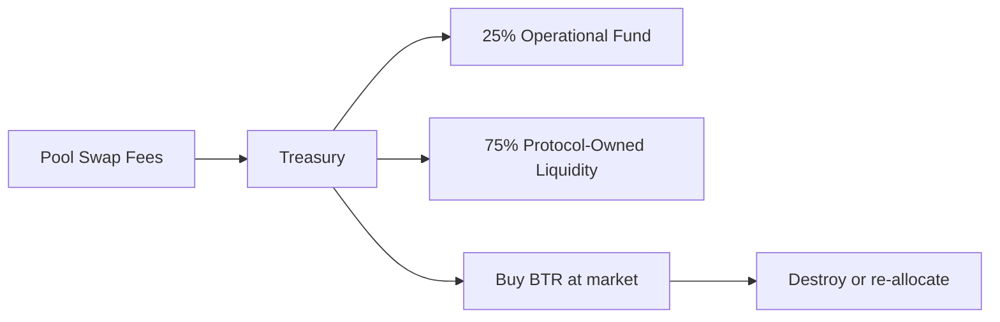

# Emission Control

> Halving-curve emission scheduling with governance-adjustable parameters and protocol fee integration

---

## 1. Overview

**Emissions** (65M BTR total over ~10 years) are distributed according to a **logarithmic decay curve** designed to:

- **Front-load liquidity incentives**: Heavy early emissions encourage initial participation
- **Sustainable tail**: Low tail emissions after 10 years ensure continued incentives
- **Governance flexibility**: Parameters adjustable within bounds for market conditions
- **Supply certainty**: Hard cap of 65M prevents hyperinflation

**Key principle**: Emissions prioritize **long-term protocol sustainability** over short-term token dumping.

---

## 2. Emission Schedule Overview

### 2.1. Total Supply Allocation

```
Total BTR supply: 100M (immutable cap)

Breakdown:
- Emissions:     65M (65%)  → Liquidity incentives over ~10 years
- Treasury:      20M (20%)  → DAO operations & strategic spending
- Team/Advisors: 12M (12%)  → Vesting over 5 years
- LBP:           3M  (3%)   → Fair-launch token sale
```

### 2.2. Emission Distribution

Of the 65M BTR emissions:

| Recipient | % | BTR Amount | Frequency |
|-----------|---|-----------|-----------|
| **sLP (liquidity providers)** | 90% | 58.5M | Weekly halving adjustments |
| **sBTR (governance stakers)** | 5% | 3.25M | Continuous, claimed on-demand |
| **Emissions treasury** | 5% | 3.25M | Discretionary, governance-approved |

---

## 3. Emission Curve & Halving Schedule

### 3.1. Halving-Curve Formula

Base emission rate follows a **geometric halving progression**:

$$E(t) = E_0 * h^{|__ t / H __|}$$

where:
- $E(t)$ = emission rate at time $t$ (in weeks)
- $E_0$ = base emission rate (initial, BTR/week)
- $h$ = halving factor (e.g., 0.5 = 50% reduction per cycle)
- $H$ = halving interval (e.g., 104 weeks = 2 years)
- $|__ ... __|$ = floor function (discrete halving events)

### 3.2. Default Parameters

| Parameter | Value | Rationale |
|-----------|-------|-----------|
| **E₀ (base rate)** | ~62,500 BTR/week | Calibrated to reach 65M in ~10 years |
| **H (halving interval)** | 104 weeks (2 years) | Bitcoin-style 2-year halving cycles |
| **h (halving factor)** | 0.5 (50%) | Each cycle, emissions halve |

### 3.3. Halving Schedule (Illustrative)

```
Period          Duration    E(t)          Cumulative    Annual Rate
─────────────────────────────────────────────────────────────────
Year 0-2        104 weeks   62,500        ≈32.5M       ~3.2M/week
Year 2-4        104 weeks   31,250        ≈49.8M       ~1.6M/week
Year 4-6        104 weeks   15,625        ≈57.9M       ~0.8M/week
Year 6-8        104 weeks   7,813         ≈61.9M       ~0.4M/week
Year 8-10       104 weeks   3,906         ≈63.9M       ~0.2M/week
Year 10+        Tail        ~1,953        ≈65M+        ~0.1M/week
```

**Tail emission** (after Year 10): Governance can adjust or disable; current default ~1,953 BTR/week indefinitely.

### 3.4. Cumulative Emission Chart

```chart
{
  "type": "line",
  "data": [0, 32.5, 49.8, 57.9, 61.9, 63.9, 65, 65],
  "labels": ["Year 0", "Year 2", "Year 4", "Year 6", "Year 8", "Year 10", "Year 12", "Year 14"],
  "width": 700,
  "height": 400,
  "color": "#E99339",
  "showLine": true,
  "showArea": true,
  "showPoint": true,
  "smooth": true
}
```

---

## 4. Governance Control & Adjustability

### 4.1. Parameter Bounds

Emissions can be adjusted via governance within strict bounds:

| Parameter | Current | Min | Max | Change per vote |
|-----------|---------|-----|-----|-----------------|
| **E₀** | 62,500 BTR/week | 50k/week | 80k/week | ±10k BTR/week |
| **H** | 104 weeks | 78 weeks (1.5yr) | 156 weeks (3yr) | ±26 weeks |
| **h** | 0.5 | 0.4 (60% reduction) | 0.6 (40% reduction) | ±0.05 |

**Rationale for bounds**:
- **E₀ bounds**: Prevents extreme acceleration (>80k/week) or starvation (<50k/week)
- **H bounds**: Prevents both hyperdecay (< 1.5 years) and infinite tail (> 3 years)
- **h bounds**: Ensures meaningful halving (40-60% reduction per cycle)

### 4.2. Change Process

Governance can adjust emission parameters via:

1. **Proposal phase** (48-72 hours):
   - Council proposes parameter change (e.g., E₀ increase from 62.5k to 65k BTR/week)
   - Community discussion
   - Impact analysis published (new end date, tail emissions, etc.)

2. **Voting phase** (7 days):
   - Snapshot vote with simple majority threshold (50%+)
   - Voting power calculated at snapshot block

3. **Timelock phase** (7 days):
   - Waiting period before execution
   - Community can exit if proposal turns problematic

4. **Execution phase**:
   - New parameter takes effect
   - Next emission cycle calculated with new parameter

### 4.3. Emission Routing Adjustment

Distribution of emissions across recipients can be adjusted within bounds:

| Recipient | Default | Min | Max |
|-----------|---------|-----|-----|
| **sLP** | 90% | 80% | 95% |
| **sBTR** | 5% | 2% | 10% |
| **Emissions treasury** | 5% | 3% | 10% |

**Use case for rebalancing**:
- If LP participation is too high: Increase sBTR % to incentivize governance
- If community governance is weak: Decrease treasury % to increase staker rewards
- Adjustments encourage protocol-wide participation optimization

---

## 5. Real-Time Emission Minting

### 5.1. On-Demand Minting

Emissions are **not pre-minted**. Instead:

1. **Distributor module** tracks accrued emissions (off-chain)
2. **User claim** triggers on-demand mint from Treasury
3. **Treasury verification** checks against emission cap
4. **Token minted** to user/pool

**Benefits**:
- No risk of pre-minting and losing tokens
- Flexible timing (claim whenever convenient)
- Transparent cap enforcement (every mint verified)

### 5.2. Emission Cap Enforcement

Treasury tracks **claimed emissions** vs. **total cap**:

```solidity
emissionsClaimed += amountMinted;

if (emissionsClaimed > emissionsCap) {
    revert EmissionsCapExceeded();
}
```

**Hard stop**: Once 65M is claimed, no more emissions possible (new parameter required).

### 5.3. Per-Recipient Tracking

Distributor tracks per-recipient emission rates:

```
Weekly tracking:
- sLP farming: approximately 56,250 BTR/week (90% of current E(t))
- sBTR staking: approximately 3,125 BTR/week (5% of current E(t))
- Emissions treasury: approximately 3,125 BTR/week (5% of current E(t))

Total: approximately 62,500 BTR/week (current E₀)
```

Adjustments propagate immediately to next minting cycle.

---

## 6. Emissions Economics

### 6.1. APY Projection

**Example Year 1** (E(t) = 62,500 BTR/week):

```
Annual emissions: 62,500 × 52 weeks = 3.25M BTR
Assumed TVL: $100M
Emissions value: 3.25M × $50/BTR = $162.5M

APY = $162.5M / $100M = 162.5% APY (first year, very high)
```

**Declining APY over time**:
```
Year 1:  ~162% (3.25M emissions / $100M TVL)
Year 2:  ~106% (2.13M emissions / $100M TVL)  [after first halving]
Year 3:  ~69% (1.06M emissions / $100M TVL)
Year 4:  ~45% (after second halving)
Year 10: ~5% (tail emissions become dominant)
```

**Key takeaway**: Early participants earn exceptional returns; late comers earn market-rate returns.

### 6.2. LP Incentive Decomposition

For an individual LP in pool X:

```
Annual LP reward is calculated as (TVL_X / Total_TVL) × (Coverage_X weight) × (Utilization_X weight) × 58.5M BTR

Example:
- Pool share: 10% of total protocol TVL
- Coverage: 100% (fully collateralized) → 1.0x weight
- Utilization: 70% (optimal) → 1.0x weight

Annual reward = 0.10 × 1.0 × 1.0 × 58.5M = 5.85M BTR (shared among all LPs in pool)
```

Individual LP APY then depends on **percentage of pool LP supply** owned.

---

## 7. Fee Collection & Treasury Integration

### 7.1. Fee-to-Emissions Flow

Protocol fees are routed into treasury, which can be reinvested into POL or allocated to additional emissions:



**Effect**: Fee collection directly improves protocol sustainability, reducing reliance on treasury allocations.

### 7.2. Sustainability Analysis

**Breakeven point** (when fees cover operational costs):

```
If annual opex = $5M
And protocol fee stream = $50k/month = $600k/year

Time to breakeven ≈ 8-10 years (after emissions decline)
```

Early emissions provide runway; later fees support sustainability.

---

## 8. Emissions Governance History & Adjustments

### 8.1. Version History

| Version | E₀ | H | h | Date | Reason |
|---------|-----|------|-----|------|--------|
| **v1** | 62.5k | 104w | 0.5 | TGE | Initial calibration |

### 8.2. Governance Proposal Examples

**Example 1: Acceleration** (if liquidity is scarce)
```
Current: E₀ = 62.5k, H = 104w
Proposed: E₀ = 70k, H = 104w (12% increase)
Rationale: Market downturn → need more incentives
Vote: Pass with 65% approval
Effect: +7.5k BTR/week additional emissions
New end date: ~Year 8.5 (instead of Year 10)
```

**Example 2: Extension** (if protocol is thriving)
```
Current: h = 0.5
Proposed: h = 0.6 (60% reduction per cycle, slower decay)
Rationale: Protocol sustains indefinitely; tail emissions needed
Vote: Pass with 78% approval
Effect: Emissions extended to Year 12+ with slower tail
```

---

## 9. Emergency Procedures

### 9.1. Emission Pause

If critical issue discovered:

1. **Emergency vote** (Council can initiate without waiting)
2. **Pause emissions** (temporary stop to new minting)
3. **Investigation period** (72 hours community review)
4. **Resolution vote** (resume, adjust, or permanent change)

### 9.2. Cap Adjustment (Supermajority Only)

If emissions cap of 65M proves insufficient:

1. **Supermajority vote** (67%+ approval required)
2. **Timelock** (14 days, double normal duration)
3. **Community exit period** (7 days after timelock ends before execution)
4. **New cap takes effect** (extremely rare, governance consensus required)

---

## 10. Code References

### 10.1. Emission Configuration

**Contract**: `Treasury.sol`

Functions:
- `initializeEmissions(uint256 _cap)` -Set initial cap (65M BTR)
- `mintEmissionsToDistributor(uint256 amount)` -Mint from cap, checked on-chain
- `requestEmissionsCap(uint256 newCap)` -Propose new cap (7-day timelock)
- `executeEmissionsCap()` -Execute delayed cap change

### 10.2. Distributor Integration

**Contract**: `Distributor.sol`

Tracks:
- `emissionSchedule` -Current halving curve parameters
- `perRecipientRate` -90/5/5 split among sLP/sBTR/treasury
- `lastMintBlock` -Track when last emission occurred

### 10.3. SDK Integration

**Location**: `sdk/src/rewards/`

Provides:
- `voting-power.ts` -Voting power calculations with quadratic damping
- `earning-power.ts` -LP reward calculations with quadratic damping

---

## 11. Related Documentation

- [Governance Overview](/docs/overview-governance) -Tokenomics and allocation
- [DAO Treasury](/docs/2.3-DAO-Treasury) -Treasury spending and fee collection
- [Liquid Staking](/docs/2.4-Liquid-Staking) -Reward distribution mechanics
- [Voting](/docs/2.2-DAO-Voting) -Governance voting on parameter changes

---

## 12. Design Rationale

**Community-First Allocation**:

Emissions should reward productive liquidity, not just deposits; vesting should ensure long-term commitment, not extraction.

65% emission allocation prioritizes **community-first** distribution over VC funding:
- Typical projects: 15-20% team + 15-30% investors + 5-10% public = 35-60% "extractive"
- AIMM: 65% community emissions + 20% treasury (DAO-controlled) = 85% available for actual protocol participants

---

## References

- Bitcoin Halving: [Emission Schedule Design](https://en.wikipedia.org/wiki/Bitcoin#Emission_schedule)
- Ethereum Issuance: [EIP-1559 Fee Burn](https://eips.ethereum.org/EIPS/eip-1559)
- Curve Gauge Weights: [Emissions Allocation](https://docs.curve.fi/governance/gauges/)
