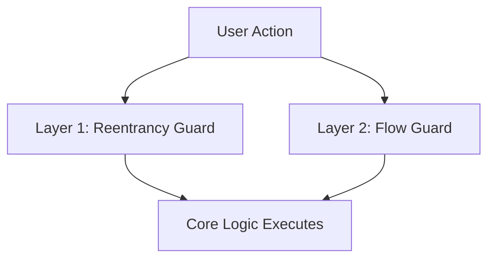
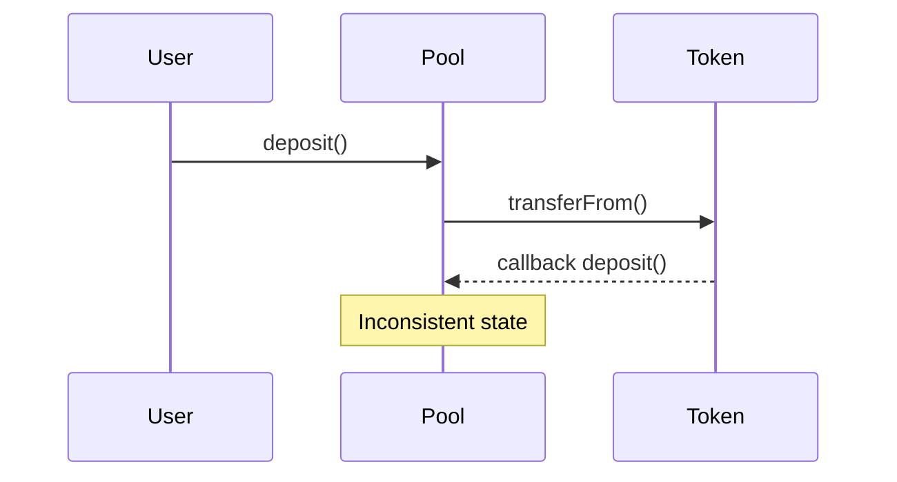
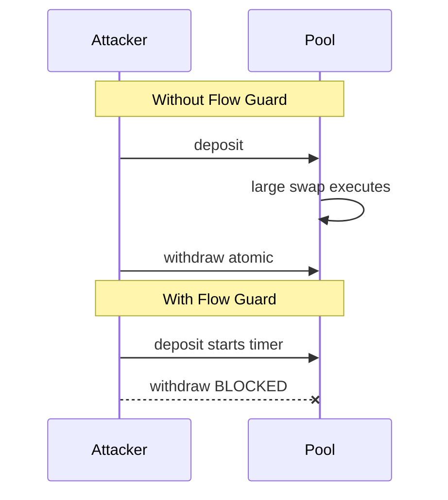
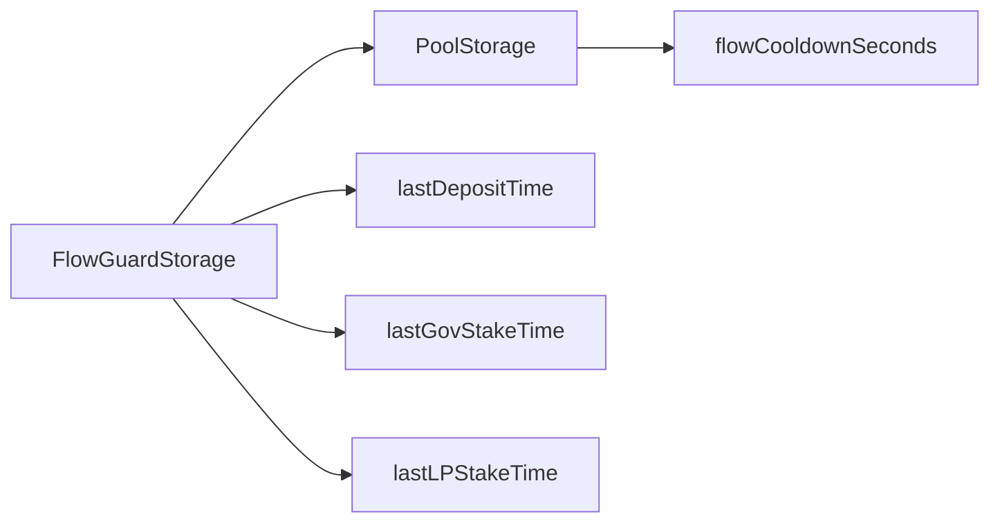
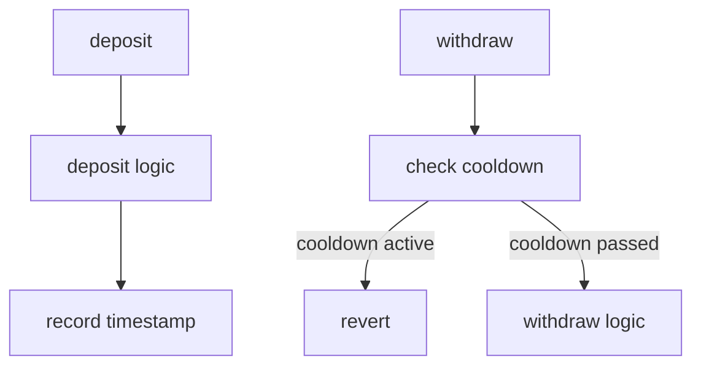
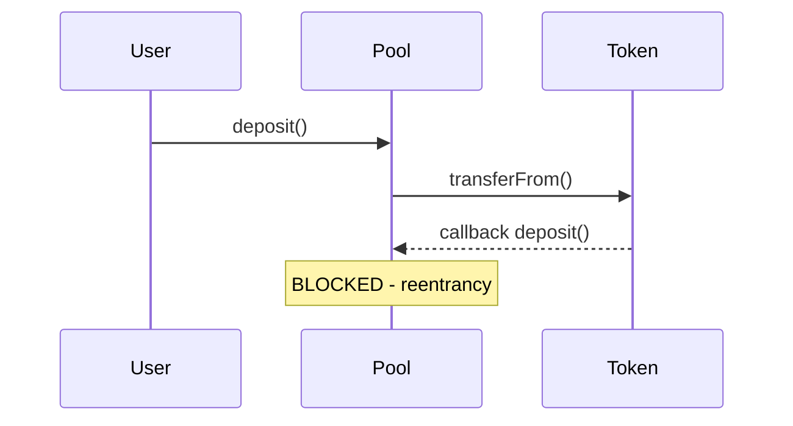
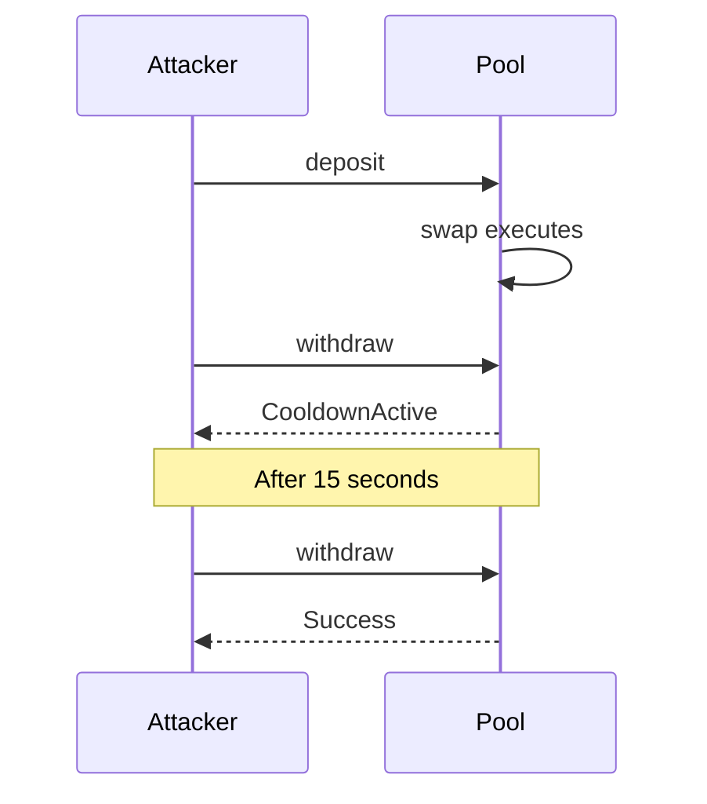
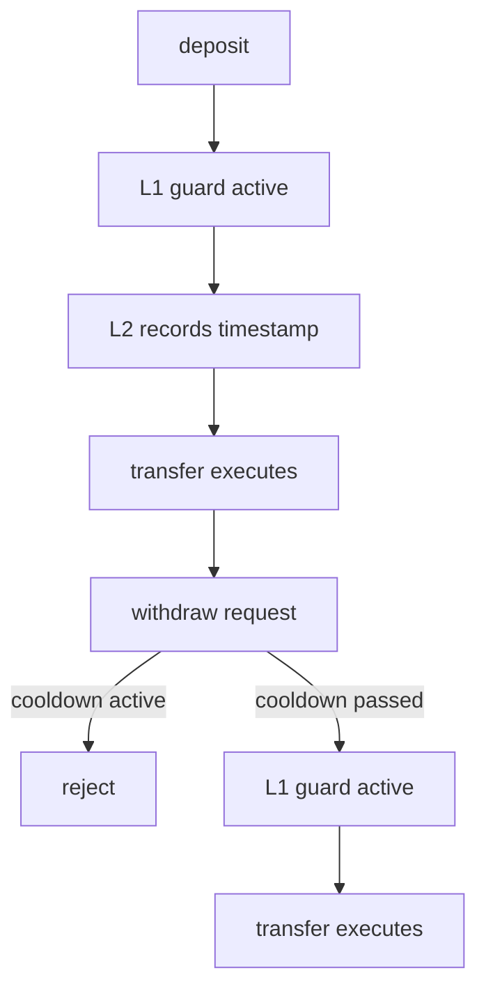
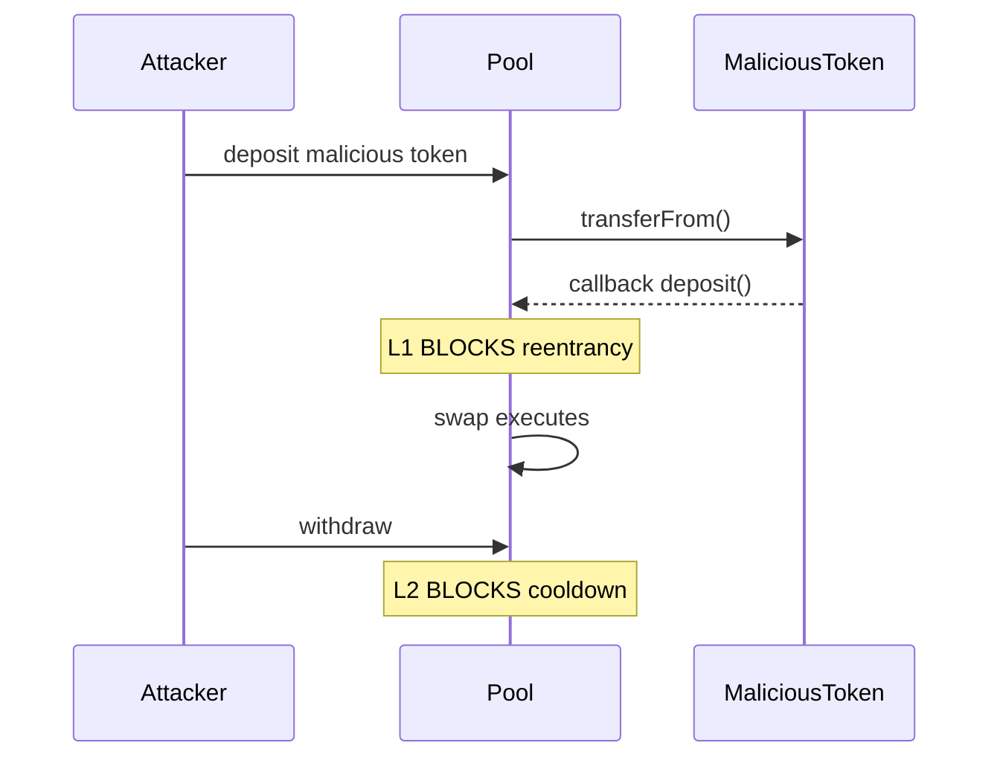

# 3.4. Flow Guards (Reentrancy & MEV Protection)

> Multi-layered temporal protection against callback, reentrancy, and JIT manipulation attacks

---

## Overview

The **Flow Guard System** is a two-layer security architecture that protects against malicious interaction flows at different attack levels:

| Layer | Mechanism | Scope | Attack Vector | Implementation |
|-------|-----------|-------|----------------|-----------------|
| **L1: Transaction Level** | Reentrancy Guard | Same transaction | Callback-based reentrancy | EIP-1153 transient storage |
| **L2: Block Level** | Time-Based Flow Guard | Cross-transaction | JIT liquidity / MEV bundles | Timestamped cooldowns |

Both layers work together to create a **defense-in-depth** strategy against flow manipulation:



---

## Layer 1: Reentrancy Guard (Transaction-Level)

### What It Protects Against

**Reentrancy** is when an external contract calls back into the pool **during the execution of an operation**, before that operation completes.

**Attack Example**:



### Implementation (EIP-1153)

The pool uses **EIP-1153 transient storage** for reentrancy protection:

```solidity
// libraries/TransientCache.sol (dex-local, EIP-1153 helpers)
// Reentrancy guard is provided by solady ReentrancyGuardTransient
// (Pool inherits it directly post Phase 42H -no ERC-7201 namespacing).
bytes32 constant REENTRANCY_GUARD_SLOT =
    0x7f9fb83b5bfa6d3...;  // transient slot constant

modifier nonReentrant() {
    uint32 status = TLoad(REENTRANCY_GUARD_SLOT).cast();
    if (status != 0) revert Reentrancy();

    TStore(REENTRANCY_GUARD_SLOT, 1);  // Set locked
    _;
    TStore(REENTRANCY_GUARD_SLOT, 0);  // Set unlocked
}
```

**Key Properties**:
- **Transient Storage** (TLOAD/TSTORE): Data cleared at end of transaction
- **Zero Cost** on revert: Transient storage is automatically cleaned up
- **Simple**: Single locked/unlocked flag
- **Fast**: ~100 gas (vs ~20k for sstore)

### Protected Operations

All user-facing pool operations are wrapped:
- `deposit()` - prevents callback during transfer
- `withdraw()` - prevents callback during transfer
- `swap()` - prevents callback during swaps
- `stakeGov()`, `stakeLP()`, etc. - all external calls protected

### What Reentrancy Guard Does NOT Prevent

**Same-block attacks** that don't use callbacks:
- JIT liquidity bundles (Flashbots ordering)
- Multi-transaction atomic sequences in same block
- MEV sandwich attacks
- Price oracle staleness attacks

These require **Layer 2 (Flow Guard)** protection.

---

## Layer 2: Flow Guard (Block-Level MEV Protection)

### What It Protects Against

**JIT (Just-In-Time) Liquidity** is an MEV strategy where sophisticated actors:

1. **Observe** a pending large swap in the mempool
2. **Deposit** liquidity in the same block (via Flashbots bundle)
3. **Capture** swap fees from the large trade
4. **Withdraw** liquidity in the same block (atomic)

This extracts value that should go to long-term LPs, without bearing any price risk.

**Research Context**:
- JIT attacks account for ~0.5-1% of Uniswap v3 volume
- Dominated by 3-5 sophisticated MEV bots
- Average extraction: 5-15 bps per targeted swap
- Long-term LPs lose fee income to zero-risk extractors

### Protected Flows

| Flow | Entry Action | Exit Action | Protection | Use Case |
|------|--------------|-------------|-----------|----------|
| **Deposit→Withdraw** | `deposit()` | `withdraw()`, `withdrawTo()` | 15s cooldown | Prevents JIT LP positioning |
| **Stake Gov→Unstake Gov** | `stakeGov()` | `unstakeGov()` | 15s cooldown | Prevents instant voting/reward capture |
| **Stake LP→Unstake LP** | `stakeLP()` | `unstakeLP()` | 15s cooldown | Prevents JIT reward farming |

**Example Attack Timeline**:



---

## How Time-Based Flow Guard Works

### Architecture



### Operation Flow



### Time-Based (Not Block-Based)

The cooldown is measured in **seconds**, not blocks. This ensures:

- Consistent protection across all EVM chains
- Works on chains with variable block times (Arbitrum, Polygon, etc.)
- Protection scales with real-world time, not validator behavior

---

## Configuration

### Default Value

```solidity
uint16 constant DEFAULT_FLOW_COOLDOWN = 15; // 15 seconds
```

The 15-second default was chosen because:
- **Long enough** to span multiple blocks on any major EVM chain
- **Short enough** to not impede legitimate users
- **Practical** for cross-chain consistency

### Admin Control

Pool owners can adjust the cooldown:

```solidity
// Increase protection (e.g., during high MEV activity)
pool.setFlowCooldown(30); // 30 seconds

// Disable for trusted environments (NOT recommended for public pools)
pool.setFlowCooldown(0);
```

**Note**: Setting `flowCooldownSeconds = 0` completely disables the flow guard.

### Maximum Value

The `uint16` type allows up to 65,535 seconds (~18.2 hours). Values above 300 seconds (5 minutes) are generally impractical.

---

## Error Handling

When a cooldown violation is detected:

```solidity
error CooldownActive(uint32 remainingSeconds);
```

Example:
- User deposits at T=100
- User tries to withdraw at T=105 (cooldown=15s)
- Reverts with `CooldownActive(10)` (10 seconds remaining)

---

## Defense-in-Depth Architecture

### Attack Surface Coverage

The two-layer system protects against different attack surfaces:

#### L1 vs L2 Comparison

| Property | Reentrancy Guard (L1) | Flow Guard (L2) |
|----------|----------------------|-----------------|
| **Scope** | Same transaction | Cross-transaction |
| **Duration** | Single function call | 15 seconds |
| **Attack Vector** | Callback reentrancy | JIT liquidity / MEV |
| **Implementation** | TLOAD/TSTORE flag | Timestamp cooldowns |
| **Gas Cost** | ~100 gas | ~5-7k gas per operation |
| **Frequency** | Every operation | Entry + exit check |

#### Attack Timeline Example

**Reentrancy Attack (L1):**



**JIT Liquidity Attack (L2):**



#### Why Both Layers Matter

- **Layer 1 alone** (just reentrancy guard): Stops callback attacks but not MEV bundles
- **Layer 2 alone** (just flow guard): Stops JIT attacks but not malicious callbacks
- **Both layers** (defense-in-depth): Comprehensive protection against flow manipulation

**Example**: If Layer 1 didn't exist, a malicious token could:
1. User calls `deposit(maliciousToken, 1000)`
2. Pool transfers 1000 tokens
3. Token's fallback calls `withdraw()` on pool
4. Withdrawal succeeds during deposit → potential theft

This attack is prevented by Layer 1's reentrancy guard.

### Stake Lock Duration

Staking already has a `stakeLockDuration` (default 14 days) that prevents unstaking for a period. Flow Guard adds an additional **entry-side** protection:

- **Stake Lock**: Prevents early unstake regardless of entry timing
- **Flow Guard**: Prevents immediate unstake after stake (JIT reward capture)

A user who stakes must wait:
1. `flowCooldownSeconds` (15s) before they can even attempt to unstake
2. `stakeLockDuration` (14 days) before the stake is actually unlocked

---

## Combined Protection Model

### How Layers Interact

Both reentrancy guard and flow guard are applied to complementary operations:

```solidity
function deposit(address token, uint256 amount) external nonReentrant {
    // Layer 1: Reentrancy guard active (TSTORE locked)
    // Prevents callbacks during token transfer

    // ... deposit logic ...

    // Layer 2: Record deposit timestamp (for flow guard)
    _recordDepositTime(msg.sender, token);
}

function withdraw(address token, uint256 lpAmount) external nonReentrant {
    // Layer 1: Reentrancy guard active (TSTORE locked)
    // Prevents callbacks during token transfer

    // Layer 2: Check flow guard cooldown
    _checkWithdrawCooldown(msg.sender, token);

    // ... withdrawal logic ...
}
```

### Sequential Protection

User flow is protected at both levels:



### What About Both Attacks Simultaneously?

A sophisticated attacker might try to combine strategies:



Even if Layer 1 didn't exist, Layer 2 would still prevent the JIT attack.
Even if Layer 2 didn't exist, Layer 1 would still prevent the callback attack.

**Result**: Two independent, complementary defenses.

---

## Implementation Details

### Layer 1: Reentrancy Guard Storage (Transient)

Reentrancy guard uses **EIP-1153 transient storage** (TLOAD/TSTORE):

```solidity
// lib/LibTransientCache.sol
bytes32 constant REENTRANCY_GUARD_SLOT =
    0x7f9fb83b5bfa6d3c2e1a0f4b8c6d2e1a5f0b4c8d6e2f1a3b5c7d9e0f1a3b5c7d;

// Single boolean flag (uint32 for alignment)
// 0 = unlocked (default)
// 1 = locked (operation in progress)

modifier nonReentrant() {
    uint32 status = TLoad(REENTRANCY_GUARD_SLOT);
    if (status != 0) revert Reentrancy();

    TStore(REENTRANCY_GUARD_SLOT, 1);  // Lock
    _;
    TStore(REENTRANCY_GUARD_SLOT, 0);  // Unlock
}
```

**Transient Storage Advantages**:
- Data lives only for one transaction
- Automatically cleaned up at end of transaction
- No gas refunds needed
- Fast access (~100 gas vs ~20k for persistent storage)
- Perfect for mutex flags

### Layer 2: Flow Guard Storage (Persistent)

Flow guard state lives in the `Pool` clone's own default storage (Phase 42H -no ERC-7201 namespacing; each clone is a fresh storage space):

```solidity
// Constants.sol (dex-local) -slot constants kept for grep-stability.
bytes32 constant FLOW_GUARD_STORAGE_LOC =
    0x8a7c9f2e5b3d1a4c6e8f0d2b4a6c8e0f2d4b6a8c0e2f4d6b8a0c2e4f6d8b0a00;

// IPool.sol
struct FlowGuardStorage {
    // Per-user, per-token deposit timestamps
    mapping(address => mapping(address => uint32)) lastDepositTime;

    // Per-user governance stake timestamps
    mapping(address => uint32) lastGovStakeTime;

    // Per-user, per-token LP stake timestamps
    mapping(address => mapping(address => uint32)) lastLPStakeTime;
}
```

**Storage Design**:
- Three separate timestamp mappings for three flow types
- `uint32` timestamps (good until year 2106)
- Namespace prevents collision with other pools/contracts
- Persistent storage needed to track across transactions

### Gas Costs

#### Layer 1: Reentrancy Guard

| Operation | Gas Cost | Note |
|-----------|----------|------|
| Entry (TSTORE 1) | ~100 | Transient storage write |
| Exit (TSTORE 0) | ~100 | Transient storage clear |
| Revert check (TLOAD) | ~100 | Read on reentry attempt |
| **Total per operation** | ~100-200 | Applied to ALL external calls |

#### Layer 2: Flow Guard

| Operation | Gas Cost | Context |
|-----------|----------|---------|
| Record timestamp (deposit) | ~5,000 | SSTORE to cold slot (first time) |
| Record timestamp (stake) | ~5,000 | SSTORE to cold slot (first time) |
| Check cooldown (withdraw) | ~2,100 | SLOAD from slot (already warm) |
| Check cooldown (unstake) | ~2,100 | SLOAD from slot (already warm) |

#### Combined Overhead

| Operation | L1 | L2 | Total |
|-----------|----|----|-------|
| `deposit()` (write timestamp) | 100 | 5,000 | ~5,100 |
| `withdraw()` (check cooldown) | 100 | 2,100 | ~2,200 |
| `swap()` (no flow guard) | 100 | 0 | ~100 |

**Context**:
- A typical deposit costs ~100-200k gas
- Flow guard adds ~2-5% overhead
- Reentrancy guard adds <1% overhead
- Combined overhead is small relative to operation cost

**Optimization note**: After first warm-up, subsequent operations on same storage slot cost less due to "warm" slot pricing (100 gas vs 2,100 gas).

---

## What Flow Guards Does NOT Protect Against

### Layer 1 Limitations (Reentrancy Guard)

Reentrancy guard **only** protects against callback-based attacks:

1. **Multi-step attacks** - Attacks that require user interaction outside the callback (e.g., "step 1: transfer out, step 2: user action, step 3: callback")
2. **Cross-contract reentrancy** - If the pool calls Contract A, which calls Contract B, which calls back into pool (needs more sophisticated analysis)

### Layer 2 Limitations (Time-Based Flow Guard)

Flow guard **does not** protect against:

1. **Long-term statistical arbitrage** - If someone deposits for 1 day, they still capture fees during that time
2. **Information-based trading** - Traders with alpha about future prices (this is not MEV extraction)
3. **Cross-pool attacks** - Coordination across multiple pools
4. **Off-chain coordination** - Multiple wallets controlled by same entity
5. **Oracle manipulation** - Price feed attacks (separate concern, handled by oracle layer)

### Complementary Defenses

Both flow guards are one layer in a **comprehensive defense-in-depth** strategy:

| Layer | Mechanism | Prevents |
|-------|-----------|----------|
| **L1: Reentrancy** | Transient storage flag | Callback attacks during operation |
| **L2: Flow Guard** | Timestamped cooldowns | JIT liquidity and MEV bundling |
| **L3: Pricing** | Directional fees | Toxic/coverage-worsening trades |
| **L4: Oracle** | TWAP + staleness checks | Price feed manipulation |
| **L5: Volatility** | Spread adjustment | Exploitation during uncertainty |

**Example**: A complete attack chain might involve:
1. Oracle manipulation (L4 blocks)
2. Attempt to exploit pricing (L3 charges premium)
3. JIT deposit-and-swap (L2 blocks)
4. Malicious callback (L1 blocks)

Each layer independently protects, and combined they create comprehensive security.

---

## Summary: Two-Layer Flow Protection

The **Flow Guard System** consolidates two complementary security mechanisms into a unified architecture:

### Layer 1: Reentrancy Guard (Transaction-Level)
- **Scope**: Same transaction
- **Protection**: Callback-based reentrancy attacks
- **Implementation**: EIP-1153 transient storage flag
- **Cost**: ~100 gas per operation
- **Applies to**: All external calls (deposit, withdraw, swap, stake, etc.)

### Layer 2: Time-Based Flow Guard (Block-Level)
- **Scope**: Cross-transaction (15-second default cooldown)
- **Protection**: JIT liquidity and MEV bundling attacks
- **Implementation**: Timestamped cooldowns on complementary operations
- **Cost**: ~5k gas on entry, ~2.1k gas on exit
- **Applies to**: Deposit→withdraw, stake→unstake flows

### Design Principles

1. **Defense-in-Depth**: Both layers work independently
   - Layer 1 alone stops callback attacks
   - Layer 2 alone stops JIT attacks
   - Combined = comprehensive protection

2. **Low Gas Overhead**
   - Reentrancy: <1% of operation cost
   - Flow guard: 2-5% of operation cost
   - Minimal friction for users

3. **Per-Transaction Clarity**
   - Layer 1 clears automatically at end of transaction
   - Layer 2 persists across transactions
   - No manual cleanup needed

4. **Simple, Auditable Code**
   - Single flag per transaction (Layer 1)
   - Three timestamp mappings (Layer 2)
   - No complex state machines

### Key Takeaway

The two layers protect different attack surfaces:
- **Reentrancy Guard**: "Can you call back into us during our operation?"
  - Answer: No, flag prevents it

- **Flow Guard**: "Can you deposit and withdraw atomically in the same block?"
  - Answer: No, 15-second cooldown prevents it

Together, they form a robust defense against the most common flow manipulation attacks on AMMs.

---

## Related Documentation

- [3.1. Security Overview](./Overview.md)
- [1.2.4. Spread & Fees](../1.%20AIMM/1.1.%20Pricing/1.1.4.%20Spread%20&%20Fees.md)
- [1.2.6. Anti-Toxic Flow Protection](../1.%20AIMM/1.1.%20Pricing/1.1.6.%20Toxic%20Flow%20Mitigation.md)
