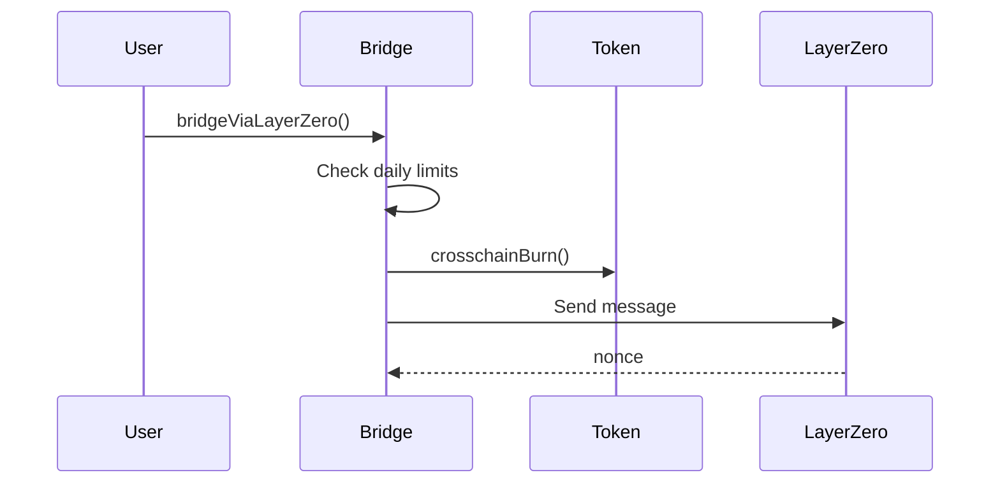
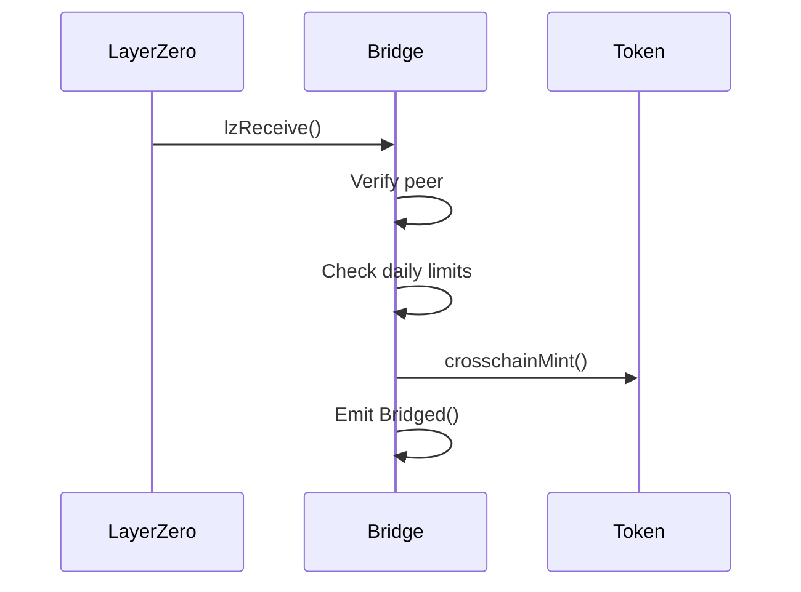

# Bridging

> Cross-chain token transfers using ERC-7802 and LayerZero V2

---

## 1. Overview

The BTR Bridge (`Bridge`) -LayerZero v2 OApp endpoint -enables cross-chain transfers of:
- **BTR**: Governance tokens
- **sBTR**: Staked governance tokens
- **LP Tokens**: Pool LP tokens marked as bridgeable

**Standard**: ERC-7802 (cross-chain token standard)
**Messaging**: LayerZero V2 OApp

**Contract**: `contracts/src/Bridge.sol`
**Interface**: `IBridge`

---

## 2. Bridge Flow

### 2.1. Outbound (Source Chain)



### 2.2. Inbound (Destination Chain)



---

## 3. Integration

### 3.1. Quote Fee

```solidity
ILayerZeroEndpointV2.MessagingFee memory fee = bridge.quoteLZBridge(
    tokenAddress,
    dstEid,        // LayerZero endpoint ID
    amount,
    options        // Custom options (optional)
);
```

**Endpoint IDs**:
| Chain | Eid |
|-------|-----|
| Ethereum | 101 |
| Arbitrum | 110 |
| Optimism | 111 |
| Base | 184 |

### 3.2. Bridge Tokens

```solidity
// 1. Approve bridge to burn
IERC20(token).approve(address(bridge), amount);

// 2. Execute bridge with exact fee
bridge.bridgeViaLayerZero{value: fee.nativeFee}(
    token,
    dstEid,
    bytes32(uint256(uint160(recipient))), // Convert to bytes32
    amount,
    options
);
```

**TypeScript SDK**:
```typescript
import { Bridge } from '@btr-protocol/sdk';

const bridge = new Bridge(bridgeAddress, signer);

// Quote
const fee = await bridge.quoteLZBridge(token, dstEid, amount, '0x');

// Approve and bridge
await token.approve(bridgeAddress, amount);
const tx = await bridge.bridgeViaLayerZero(
    token,
    dstEid,
    recipient,
    amount,
    '0x',
    { value: fee.nativeFee }
);
```

---

## 4. Rate Limiting

The bridge uses **B64 encoding** for gas-efficient daily limits:

```solidity
struct TokenConfig {
    uint64 limitOutB64;     // Daily outbound limit
    uint64 bridgedOutB64;   // Outbound volume today
    uint64 bridgedInB64;    // Inbound volume today
    uint16 day;             // Day index (UTC)
    uint8  inRatio;         // Inbound % of outbound
    uint8  flags;           // SUPPORTED | PAUSED | UNLIMITED
}
```

**Query Limits**:
```solidity
(uint256 outbound, uint256 inbound) = bridge.getRemainingLimits(token);
```

**Flags**:
| Flag | Value | Effect |
|------|-------|--------|
| SUPPORTED | 0x01 | Token enabled for bridging |
| PAUSED | 0x02 | Emergency pause (instant) |
| UNLIMITED | 0x04 | No rate limits |

---

## 5. Configuration

### 5.1. Initial Token Setup

```solidity
bridge.setTokenConfig(
    token,
    1_000_000e18,  // Daily limit (raw)
    18,            // Decimals
    120,           // 120% inbound ratio
    false          // Not unlimited
);
```

### 5.2. Update Configuration (2-day timelock)

```solidity
// Request
bridge.requestConfigChange(
    token,
    2_000_000e18,  // New limit
    18,
    150,           // New ratio
    true,          // Update limit
    true           // Update ratio
);

// Execute after 2 days
vm.warp(block.timestamp + 2 days);
bridge.executeConfigChange(token);
```

### 5.3. Set Peer (2-day timelock)

```solidity
bridge.requestSetPeer(110, bytes32(uint256(uint160(arbBridge))));
vm.warp(block.timestamp + 2 days);
bridge.executeSetPeer(110);
```

---

## 6. Emergency Controls

### 6.1. Pause Token (Instant)

```solidity
bridge.pauseToken(token, true);   // Pause
bridge.pauseToken(token, false);  // Unpause
```

### 6.2. Cancel Operation

```solidity
bytes32 opId = keccak256(abi.encode(OpType.ConfigUpdate, token));
bridge.cancelOperation(opId);
```

---

## 7. Events

```solidity
event Bridged(
    address indexed user,
    address indexed token,
    uint32 indexed dstEid,
    bytes32 receiver,
    uint256 amount,
    uint64 nonce,
    Direction dir
);

event TokenConfigured(address indexed token, uint64 limit, uint8 inRatio, uint8 flags);
event PeerSet(uint32 indexed eid, bytes32 peer);
event TokenPaused(address indexed token, bool paused);
```

---

## 8. Error Handling

| Error | Cause | Solution |
|-------|-------|----------|
| `NotConfigured(BRIDGE_PEER)` | Destination chain not set | Configure peer |
| `NotConfigured(ASSET)` | Token not supported | Add via `setTokenConfig()` |
| `InsufficientAmount` | Daily limit exceeded | Wait for UTC reset |
| `InsufficientAmount` | Wrong msg.value | Use exact fee from quote |

---

## 9. Bridgeable Assets

| Asset | Criteria |
|-------|----------|
| BTR | Implements `IERC7802` |
| sBTR | Implements `IERC7802` |
| LP Tokens | Marked with `BRIDGEABLE_BIT` in pool risk config |

---

## 10. Related Documentation

- [Composability](../../1.\ AIMM/1.3.\ Integration/1.3.1.\ Composability.md) -Token swaps
- [Liquid Staking](../../2.\ Governance/2.4.\ Liquid\ Staking.md) -sBTR details
- [Security Overview](../../3.\ Security/Overview.md) -Bridge security
