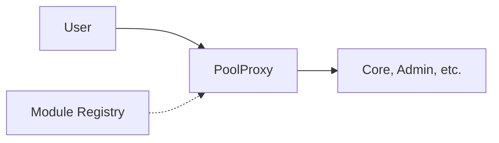
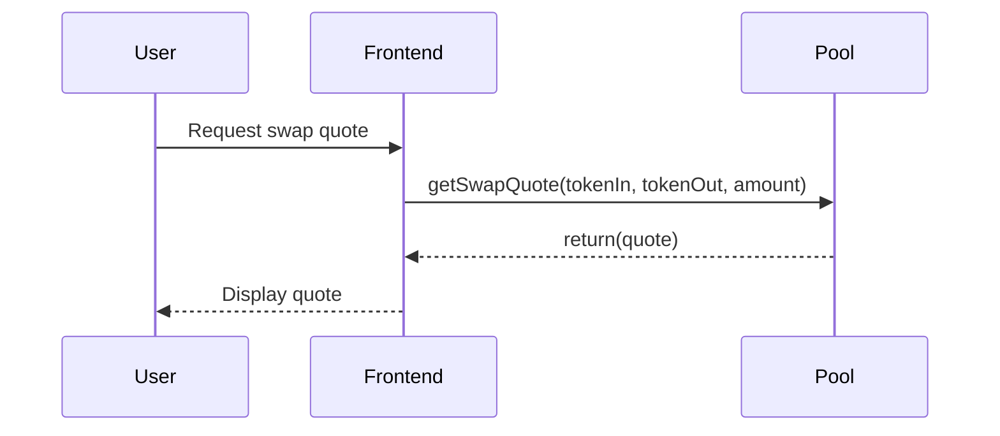
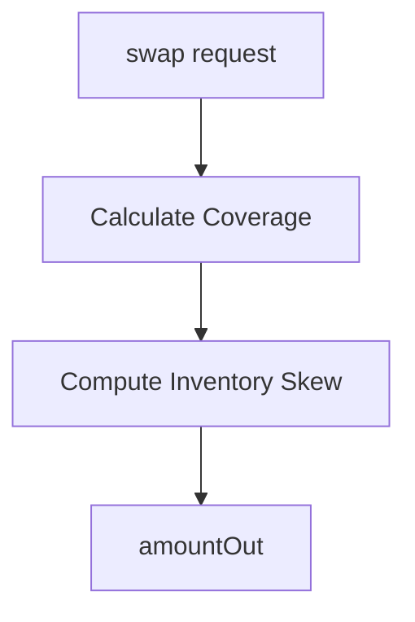

# Technical Documentation Best Practices

**Focus**: DeFi Protocol Documentation + Developer Experience + Public Guides

> **Architecture note (post Phase 42H)** -diagrams or snippets in this file that show `PoolProxy` / Diamond / ERC-7201 are illustrative examples of documentation patterns, not the BTR DEX's current architecture (which uses standalone singletons + EIP-1167 `Pool` clones).

---

## Quick Reference

| Area | Standard |
|------|----------|
| **Link Format** | `/docs/slug#anchor` (slugified, no extension) |
| **Math** | AsciiMath with WHERE blocks, rendered to MathML at build time |
| **Diagrams** | Mermaid (rendered to SVG at build time) |
| **Tables** | GFM tables with optional headless mode (empty cells with spaces) |
| **Code Docs** | NatSpec (Solidity), JSDoc (TypeScript) |
| **Accessibility** | Public, AI-indexable, no login walls |

---

## 1. Documentation Structure

### Public Documentation (`docs/`)

```
docs/
├── Overview.md           # Protocol overview
├── Foundations.md        # Core concepts
├── Glossary.md           # Terminology
├── 1. AIMM/              # Protocol concepts
│   ├── Overview.md       # AIMM architecture
│   ├── 1.1. Pricing/     # Pricing mechanics
│   │   ├── 1.1.1. Inventory Management.md
│   │   ├── 1.1.2. Liquidity Shaping.md
│   │   ├── 1.1.3. Anchor Path Pricing.md
│   │   ├── 1.1.4. Spread & Fees.md
│   │   ├── 1.1.5. Slippage & Price Impact.md
│   │   ├── 1.1.6. Toxic Flow Mitigation.md
│   │   ├── 1.1.7. Parametrization.md
│   │   └── 1.1.8. Invariants.md
│   ├── 1.2. Modules/     # Smart contract modules
│   │   ├── 1.2.1. Core.md
│   │   ├── 1.2.2. Internal Oracle.md
│   │   ├── 1.2.3. Admin.md
│   │   ├── 1.2.4. Staking.md
│   │   ├── 1.2.5. Distributor.md
│   │   └── 1.2.6. Flash.md
│   └── 1.3. Integration/  # Integration guides
│       ├── 1.3.1. Composability.md
│       ├── 1.3.2. Hooks.md
│       ├── 1.3.3. Curation & White Labelling.md
│       └── 1.3.4. Bridging.md
├── 2. Governance/        # DAO and voting
│   ├── Overview.md
│   ├── 2.1. BTR Token.md
│   ├── 2.2. DAO Voting.md
│   ├── 2.3. DAO Treasury.md
│   ├── 2.4. Liquid Staking.md
│   └── 2.5. Emission Control.md
├── 3. Security/          # Security model
│   ├── Overview.md
│   ├── 3.1. Audits.md
│   ├── 3.2. Deployment & Upgrades.md
│   ├── 3.3. Access Control.md
│   ├── 3.4. Flow Guards.md
│   └── 3.5. Oracles.md
├── 4. User Guides/       # End-user documentation
│   ├── Overview.md
│   └── 4.8. Price Charts.md
└── 5. Contributing/     # Developer guides
    ├── GIT.md
    ├── FRONTEND.md
    ├── BACKEND.md
    ├── SMART_CONTRACTS.md
    ├── SECURITY.md
    ├── QUANT.md
    ├── DOCUMENTATION.md
    ├── ARCHITECTURE.md
    └── MARKETING.md
```

---

## 2. Cross-Reference Links

### Link Format

**Use slugified paths with `/docs/` prefix:**

```markdown
✅ CORRECT
[Inventory Management](/docs/1.1.1-inventory-management)
[Spread & Fees §3](/docs/1.1.4-spread-fees#3-spread-calculation)

❌ WRONG
[Inventory Management](./1.1.1.%20Inventory%20Management.md)
[Inventory Management](../1.1.1. Inventory Management.md)
```

### Slug Generation

File: `1.1.1. Inventory Management.md` → Slug: `1.1.1-inventory-management`

- Lowercase
- Hyphens instead of spaces
- Preserves section numbers (dots)
- No file extension
- Use `/docs/` prefix for absolute links from anywhere

### Anchor Links

```markdown
## 3. Spread Calculation

Link here with: [Section 3](/docs/1.1.4-spread-fees#3-spread-calculation)
```

---

## 3. Math Notation (AsciiMath)

### Format

All math is rendered at **build time** from AsciiMath to MathML.

```markdown
Block (display): $$expression$$ → `$$x^2 + y^2 = z^2$$`
Inline (definition/embedding): $expression$ → `$x + y$`, `$pi$`, `$sum_{i}$`
```

### AsciiMath Syntax

**Basic Symbols:**

| Symbol | AsciiMath |
|--------|-----------|
| Center dot (·) | `*` |
| Cross (×) | `xx` |
| Fraction | `a/b` |
| Square root | `sqrt(x)` |
| Summation | `sum_{i=0}^n` |
| Subscript | `x_i` or `phi_i` |

**Grouping:**

| Type | Syntax |
|------|--------|
| Visible parentheses | `(` `)` |
| Invisible grouping | `{` `}` |
| Visible curly braces | `{:` `:}` |

**Systems of Equations:**

Use matrix syntax with left bracket `{|` and right bracket `::|}`:

```markdown
$${| 2x;+;17y;=;23;; x;-;y;=;5 ::|}$$
```

Renders as:
$${| 2x;+;17y;=;23;; x;-;y;=;5 ::|}$$

**Syntax rules:**
- Cells separated by semicolons (`;`)
- Rows separated by double semicolons (`;;`)
- Left bracket: `{|` (required for systems)
- Right bracket: `::|}` (with closing brace)

**IMPORTANT:** Systems of equations must use `$${| ... ::|}$$` format (with closing brace)

**Examples:**

$$Simple:         a/b$$

$$Complex:        {x + y}/{z - w}$$

$$Multi-term:     {sigma * nu}/{100M}$$

$$System:         {| d_1 = abs(x - y);; d_2 = abs(x);; d = max(d_1, d_2) ::|}$$

**Angle Brackets:**

- Much less/greater: `<<` → ≪, `>>` → ≫
- Angle brackets: `: :` → 〈 〉 (use `(:` and `:)`)

**Over/Underbraces:**

- Underbrace: `ubrace{exp}_{exp}` → `$$ubrace{1+2+3+4}_{"under"}$$`
- Overbrace: `obrace{exp}^{exp}` → `$$obrace{1+2+3+4}^{"over"}$$`

### Math Definitions (where: blocks)

When defining mathematical symbols after a formula, use markdown `where:` lists format:

**CORRECT FORMAT:**
```markdown
$$sigma_i = {sigma_(f,i) + sigma_(s,i)}/2$$

where:
- $sigma_f$ = fast EMA volatility
- $sigma_s$ = slow EMA volatility
```

**WRONG FORMAT:**
```markdown
$$sigma_i = {sigma_(f,i) + sigma_(s,i)}/2$$

$$
WHERE
sigma_f = "fast EMA volatility"
sigma_s = "slow EMA volatility"
$$
```

**Rules:**
1. Use `where:` (lowercase) followed by markdown bullet list
2. Use inline `$...$` math for ALL mathematical symbols, Greek letters, subscripts, superscripts, and expressions
3. Do NOT use quotes around descriptions
4. Do NOT wrap definitions in `$$...$$` blocks
5. Place `where:` list immediately after the last `$$...$$` expression
6. For multiple consecutive `$$...$$` expressions, place single `where:` list after all of them
7. Keep ranges like $[0, 1]$, $[-100, +100]$ in inline math notation

### Symbol Naming

- Prefer greeks (compiled to symbols) or single-letter variables: `S`, `U`, `c`
- PLAIN names only for greeks: `$pi$`, `$gamma$`, `$sigma$`, `$lambda$` (WRONG: `$\pi$`, `$\sum$` (these are LaTeX))
- Use subscripts for variants: `S_v`, `S_f`, `phi_i`, `phi_o`
- Avoid verbose strings: ~~`S_"final"`~~ → `S_f`

---

## 4. Diagrams (Mermaid)

### Usage

Diagrams are rendered to **SVG at build time** via Playwright.

### Supported Types

| Type | Use Case |
|------|----------|
| **graph** | Architecture, flowcharts, state diagrams |
| **sequenceDiagram** | Transaction flows, user interactions |
| **flowchart** | Process flows, decision trees |

### Examples

**Architecture:**



**Sequence:**



**Flowchart:**



---

## 5. Headless Tables

### What Are Headless Tables?

Headless tables are markdown tables that render without visible headers. They're useful for:

- **Structured data display** where column meaning is obvious from context
- **Configuration lists** with no need for column labels
- **Compact presentation** of parameter sets, permissions, or mappings
- **Tabular data** where headers would be redundant

### Syntax Requirements

**CRITICAL**: Empty header cells must contain **spaces** for the markdown parser to recognize it as a table.

```markdown
| | | | |               ✅ CORRECT - spaces in empty cells
|---|---|---|---|
| Data 1 | Data 2 | Data 3 | Data 4 |

|||||                      ❌ WRONG - no spaces, renders as paragraph
|---|---|---|---|
| Data 1 | Data 2 | Data 3 | Data 4 |
```

### How It Works

1. **Markdown Compilation**: marked.js parses the table with empty header cells
2. **HTML Generation**: Creates `<thead>` with empty `<th>` elements (with `sortable` class)
3. **CSS Hiding**: The `:has()` pseudo-class detects empty headers and hides the entire `<thead>`
4. **Final Render**: Table displays with body content only

### Technical Implementation

**CSS Rules** (from `/front/src/styles/markdown.css`):

```css
/* Hide empty table headers */
.markdown-content table>thead:has(th:empty),
.markdown-content table>thead:has(th.sortable:empty) {
  display: none !important;
}

/* Also hide if all header cells are empty (including those with classes) */
.markdown-content table>thead tr:has(th):not(:has(th:not(:empty))) {
  display: none !important;
}
```

**Key Points**:
- Uses CSS `:has()` pseudo-class (requires modern browser support)
- Handles `th` elements with and without `sortable` class
- `sortable` class is added by `precompile-markdown.ts` during build

### Common Pitfalls

| Issue | Example | Fix |
|-------|---------|-----|
| **No spaces in empty cells** | `\|\|\|\|\|` | Use `\| \| \| \| \|` (spaces between pipes) |
| **Mixed empty/filled headers** | First column has label | Either all empty or use normal headers |
| **Wrong column count** | 3 data cells, 4 header cells | Ensure header separator row matches data row count |
| **Extra pipes** | Trailing `\|` after last cell | Remove trailing pipes |
| **Missing separator row** | No `\|---\|---\|` row after header | Add separator row with dashes |

### Use Cases & Examples

**1. Parameter Lists** (from Deployment & Upgrades):

```markdown
| | | | |
|---|---|---|---|
| **Operation** | **Timelock** | **Grace Period** | **Bypass** |
| `setReservePrice()` | 7 days | 0 | No |
| `setFee()` | 7 days | 0 | No |
```

Renders as a clean table with inline column labels.

**2. Permission Mappings**:

```markdown
| | | |
|---|---|---|
| `admin` | `executeTimelocked()` | ✅ |
| `operator` | `setReservePrice()` | ✅ |
| `anyone` | `swap()` | ✅ |
```

**3. Configuration Tables**:

```markdown
| | | |
|---|---|---|
| `slippage_tolerance` | `0.5%` | Maximum acceptable slippage |
| `min_liquidity` | `10,000` | Minimum LP token amount |
| `max_fee` | `1%` | Fee cap for swaps |
```

### When NOT to Use Headless Tables

| Situation | Recommendation |
|-----------|----------------|
| **Complex data** with non-obvious column meanings | Use normal headers |
| **Large tables** (5+ columns) | Use normal headers for clarity |
| **Multi-section content** where context changes | Use explicit headers |
| **Accessibility concerns** | Headers improve screen reader navigation |
| **Print/export** where structure matters | Normal headers render better |

### New Opportunities

**1. Compact UI Patterns**:
- Configuration panels with inline labels
- Permission matrices without redundant column names
- Status tables where context is provided in preceding text

**2. Enhanced Documentation**:
- Inline parameter definitions (as shown in Deployment & Upgrades)
- Reduced visual noise in technical specs
- Better mobile layout for simple tables

**3. Mixed Documentation Styles**:
- Combine headless tables with section headers for contextual clarity
- Use in code examples alongside function signatures
- Pair with markdown lists for hierarchical data

### Troubleshooting

| Symptom | Cause | Solution |
|---------|-------|----------|
| Table renders as paragraph | Empty header cells have no spaces | Add spaces: `\| \| \|` |
| Headers still visible | CSS not loaded or `:has()` not supported | Check browser compatibility, ensure CSS is imported |
| Table layout broken | Column count mismatch between header and data | Count pipes, ensure equal cells per row |
| Sorting fails (if enabled) | Empty headers break table header detection | Use normal headers for sortable tables |

### Browser Compatibility

The `:has()` pseudo-class is supported in:
- Chrome 105+
- Firefox 121+
- Safari 15.4+
- Edge 105+

For older browsers, tables will display with visible (empty) headers.

---

## 6. Code Documentation

### NatSpec for Smart Contracts

```solidity
/// @title Pool
/// @notice Liquidity pool with single-sided deposits and multi-asset support
/// @dev Implements ERC-7201 namespaced storage pattern
contract Pool {
    /// @notice Deposit single asset into pool
    /// @dev Mints LP tokens proportional to contribution. Requires prior approval.
    /// @param asset Address of asset to deposit
    /// @param amount Amount of asset to deposit (with decimals)
    /// @return lpTokens Number of LP tokens minted
    function deposit(address asset, uint256 amount)
        external
        returns (uint256 lpTokens)
    {
        // Implementation
    }
}
```

**Required for all public functions:**
- `@notice` - Clear one-line description
- `@dev` - Implementation details (if non-trivial)
- `@param` - Each parameter with units
- `@return` - Return value description

### TypeScript JSDoc

```typescript
/**
 * Calculate swap quote for token pair
 *
 * @example
 * ```ts
 * const quote = getSwapQuote('USDC', 'WETH', '1000');
 * console.log(quote.amountOut); // "0.45"
 * ```
 *
 * @param tokenIn - Input token symbol or address
 * @param tokenOut - Output token symbol or address
 * @param amountIn - Input amount as string (preserves precision)
 * @returns Quote with amountOut, priceImpact, gasEstimate
 * @throws {Error} If token pair doesn't exist
 */
export function getSwapQuote(
  tokenIn: string,
  tokenOut: string,
  amountIn: string
): SwapQuote {
  // Implementation
}
```

---

## 7. Writing Style Guidelines

### Language Principles

| Principle | Do | Don't |
|-----------|-----|-------|
| **Active voice** | "Swap tokens to earn fees" | "Tokens can be swapped..." |
| **Present tense** | "The pool calculates..." | "The pool will calculate..." |
| **Second person** | "You can deposit..." | "Users may deposit..." |
| **Concrete examples** | "For 1 ETH deposit..." | "For a deposit..." |
| **Simple words** | "Use", "Get", "Make" | "Utilize", "Retrieve", "Generate" |

### Terminology Consistency

| Term | Usage | Avoid |
|------|-------|-------|
| **Smart contract** | First mention, then "contract" | Repeated "smart contract" |
| **Function** | Code functions | "Method" (for Solidity) |
| **Wallet** | User wallets | "Account" (ambiguous) |
| **Token** | ERC20 tokens | "Coin" (unless native) |

---

## 8. Frontmatter

For SEO and indexing, use frontmatter:

```markdown
---
title: "Single-Sided Liquidity Provision"
description: "Learn how to deposit a single asset and receive LP tokens"
slug: "single-sided-liquidity"
tags: ["liquidity", "LP", "tutorial"]
---

# Single-Sided Liquidity Provision
<!-- Content -->
```

---

## 9. Build-Time Compilation

**Zero runtime deps**: markdown → HTML, AsciiMath → MathML, Mermaid → SVG

- **Script**: `scripts/precompile-markdown.ts`
- **Output**: `/front/public/compiled-docs/docs.json`
- **Frontend**: Loads pre-compiled HTML (no parsing)

See [`FRONTEND.md`](./FRONTEND.md#7-build-time-compilation) for details.

---

## 10. Review Checklist

- [ ] All cross-references use `/docs/slug#anchor` format
- [ ] Math uses AsciiMath with WHERE blocks for clarity
- [ ] Mermaid diagrams render correctly
- [ ] Tables use proper syntax (headless tables have spaces in empty cells)
- [ ] Public functions have complete NatSpec/JSDoc
- [ ] Code examples follow project style guide
- [ ] Terminology is consistent with glossary
- [ ] Frontmatter is present for SEO

---

## Internal References

- [`GIT.md`](./GIT.md) - Git workflow for docs
- [`FRONTEND.md`](./FRONTEND.md) - Build-time compilation details
- [`MARKETING.md`](./MARKETING.md) - Content marketing

---

*Last updated: 2025-01*
