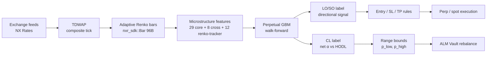

# BTR Prime - Quantitative Methodology Overview

> Mathematical foundations of BTR Prime: how perpetual gradient boosting on adaptive Renko bars + microstructure features powers both directional trading and concentrated-liquidity range management.

---

## 1. What Prime Is

**BTR Prime** is the off-chain quantitative research and decisioning engine behind the BTR protocol. It consumes a binary stream of adaptive-Renko bars produced upstream by NX Rates (the multi-exchange aggregator), extracts microstructure features, trains a perpetual gradient-boosted model in walk-forward mode, and emits two product surfaces:

1. **Directional signals** (long-only `LO` and short-only `SO` strategies, never mixed within a single parameter set) - feeding perpetual-futures and spot strategies.
2. **Concentrated-liquidity (CL) range recommendations** (lower-tick / upper-tick / rebalance triggers) - feeding the BTR ALM Vaults' on-chain `Dex.setRanges()` operation.

Both surfaces share **one** training pipeline, **one** feature matrix, **one** boosting library, and **one** fitness function. The only thing that changes across products is the **label** and a small set of post-prediction projection rules.

This document set is the theoretical companion to the production Rust code at `~/Work/btr/prime`. It is intended for internal quantitative review and external reproducibility - every formula traces to a file:line in the source.

## 2. Pipeline at a Glance

The clean separation of **bar generation** (NXR), **feature engineering + ML** (Prime), and **execution** (per-product runtime) is deliberate: it lets the same boosting model produce both directional and CL outputs without conflating the loss surfaces.

## 3. Design Invariants

The methodology is built around five hard invariants. Every section in this docs set respects them.

| # | Invariant | Why it matters |
|---|---|---|
| **I1** | All bars are **information events**, not calendar time. | Returns become approximately i.i.d. and near-Gaussian; standard ML estimators become statistically well-calibrated. (§[Information Bars](./01.%20Information%20Bars.md)) |
| **I2** | All thresholds, labels, and risk parameters are denominated in **Parkinson-σ × √H units**. | The same hyperparameters apply across instruments and regimes; no per-asset tuning. (§[Parkinson Volatility](./02.%20Parkinson%20Volatility.md)) |
| **I3** | **Long-only** and **short-only** are trained and parameterised **independently** (never mixed). | Microstructure asymmetry (squeeze vs cascade liquidation) demands independent calibration; mixed signals produce overfitting through shared parameters. |
| **I4** | Walk-forward training uses **purged labels** + **inter-fold embargo** (López de Prado 2018, ch. 7). | Eliminates label leakage; out-of-sample metrics reflect real generalisation. |
| **I5** | The **fitness function** is a weighted geometric mean of seven monthly-geometric sub-scores, gated by hard filters and discounted by trade-count confidence. | Resistant to single-month outliers; resistant to optimisation on a thin trade history. |

## 4. Document Map

This section is the entry point; the math is split across nine sequential pages. Read in order on first pass.

| # | Page | Topic |
|---|---|---|
| 01 | [Information Bars](./01.%20Information%20Bars.md) | Adaptive Renko construction; near-Gaussianity; time deformation. |
| 02 | [Parkinson Volatility](./02.%20Parkinson%20Volatility.md) | Definition + GBM derivation; rolling estimator; efficiency vs CC/GK/RS/YZ. |
| 03 | [Features](./03.%20Features.md) | 29 core + 8 cross-asset + 12 Renko-tracker features; multi-timeframe scheme. |
| 04 | [Labels](./04.%20Labels.md) | LO/SO directional + CL net-α labels; meta-labeling architecture status. |
| 05 | [Perpetual Boosting](./05.%20Perpetual%20Boosting.md) | Friedman → perpetual variant; complexity budget; ensemble; meta-classifier. |
| 06 | [Walk-Forward Validation](./06.%20Walk-Forward%20Validation.md) | Purging, embargo, fitness function decomposition. |
| 07 | [Directional Trading](./07.%20Directional%20Trading.md) | Entry / SL / TP / leverage math; mode separation; long vs short PnL. |
| 08 | [CL Range Management](./08.%20CL%20Range%20Management.md) | Uniswap V3 LP math; LVR; net-α label; range-bound projection. |
| 09 | [Hyperparameters](./09.%20Hyperparameters.md) | Full parameter table mapped to algorithmic role + sensitivity. |
| 10 | [Open Questions](./10.%20Open%20Questions.md) | Known limitations; flagged code↔doc mismatches; roadmap. |

## 5. Conventions Used Throughout

- **$P_t$**: price of the traded asset at clock time $t$.
- **$O_k, H_k, L_k, C_k$**: open / high / low / close of the $k$-th bar.
- **$r_k = \ln(C_k / C_{k-1})$**: bar log-return (close-to-close).
- **$\sigma_P$**: Parkinson volatility estimator; **$\hat\sigma_P(t)$** its rolling-window realisation.
- **$H$**: prediction horizon, in bars (default 20).
- **$\hat y_t$**: model prediction at bar $t$, in units of $\sigma_P\sqrt{H}$.
- **$\ell$**: leverage (default 3×).
- **$s$**: position fraction of capital (default 15%).
- **$\rho$**: per-trade risk budget (default 2%).

All math uses LaTeX with Temml-rendered display. Code references use the form `path:line-range`. The bibliography is per-page (cited works appear at the bottom of the page where used).

## 6. Status

**Phase 1 (live):** Adaptive Renko bars, Parkinson volatility, feature pipeline, perpetual GBM (Stage-1 primary), walk-forward harness, fitness function, directional LO/SO output, CL range output.

**Phase 2 (planned, plumbed but inactive):** Stage-2 meta-classifier for bet-sizing calibration; intra-fold seed-diverse ensembling; explicit σ-floor trade rejection (see [Open Questions §1](./10.%20Open%20Questions.md)).

**Phase 3 (research):** GARCH/EGARCH overlay for σ forecasting; regime-detection meta-feature; tail-risk-aware fitness extensions; predictive-distribution outputs (currently point estimates only).

---

**Next:** [§01 Information Bars →](./01.%20Information%20Bars.md)
