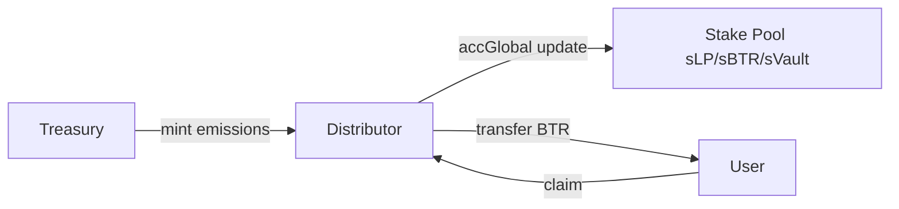

# Distributor

> Campaign-based emissions to any registered stake pool - DEX sLP, sBTR, and (forward-looking) Vault-sVault.

---

## 1. Overview

The **Distributor** module routes BTR emissions (and optionally other reward tokens) into **stake pools** registered with governance. It is **asset-agnostic**: any contract implementing `IStakable` can be whitelisted as a recipient.

**Current recipients**:
- **DEX sLP** - per-pool liquidity-provider stake receipts
- **sBTR** - governance token stake pool

**Forward-looking recipients** (post-Phase-30 generic `IStakable`):
- **sVault** - Vault-share stake pool (depositors stake their Vault shares for emission share)

---

## 2. Campaign Model

Each emission is a **Campaign** - a `(reward token, recipient, rate, start, end)` tuple:

```solidity
struct Campaign {
    address rewardToken;     // BTR by default, can be any ERC-20
    address recipient;       // IStakable contract
    uint256 ratePerSecond;
    uint256 startTime;
    uint256 endTime;
}
```

Multiple concurrent campaigns can target the same recipient (e.g. BTR + a partner token both incentivising sLP_ETH/USDC).

---

## 3. Accumulator Pattern

For each campaign, the Distributor maintains a global accumulator updated on every interaction:

```
accGlobal += ratePerSecond × Δt / totalStaked
```

User claim at block T:

```
userRewards = (accGlobal_T − accGlobal_lastClaim) × userStaked
```

**Properties**:
- O(1) per claim (no per-user iteration)
- Scales to millions of stakers
- Order-independent

---

## 4. Registering Recipients

Governance whitelists each `IStakable` recipient before campaigns can target it:

```solidity
setRecipient(stakable, allowed)   // owner: register/deregister
```

Whitelisted recipients are validated against `AccessControl.isVault()` / `isAdapter()` where applicable.

---

## 5. Emission Routing (Current Defaults)

Of 65M BTR emissions:

| Recipient | % | BTR | Stake Pool Type |
|-----------|---|-----|-----------------|
| DEX sLP holders | 90% | 58.5M | per-pool, DEX |
| sBTR stakers | 5% | 3.25M | protocol-level |
| Emissions treasury | 5% | 3.25M | discretionary |

**Forward-looking (post Vault stake pool launch)**: governance reallocates split to include sVault as a fourth row (e.g. 80% sLP / 10% sVault / 5% sBTR / 5% treasury).

---

## 6. Claim Flow



Treasury mints on-demand only; nothing is pre-minted (see [Treasury §7](./03.%20Treasury.md)).

---

## 7. Code References

**Contract**: `Distributor.sol`

Key functions:
- `addCampaign(rewardToken, recipient, rate, start, end)` - owner only
- `setRecipient(stakable, allowed)` - owner only
- `claim(campaignId)` - user
- `accGlobal(campaignId)` - view
- `pending(campaignId, user)` - view

---

## 8. Related Documentation

- [Emissions](./09.%20Emissions.md) - halving schedule that feeds Distributor
- [Staking](./04.%20Staking.md) - `IStakable` recipients
- [Treasury](./03.%20Treasury.md) - emission mint authority
