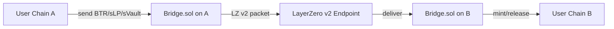

# Bridge

> LayerZero v2 OApp — bridges BTR token (and sBTR/sLP/sVault receipts where enabled) across chains for all protocol surfaces.

---

## 1. Overview

`Bridge.sol` is a **LayerZero v2 OApp** that moves protocol tokens between chains. It supports:

- **BTR token** — primary bridgeable asset (canonical supply mirrored across chains)
- **sBTR** — staked-BTR receipt (where governance enables remote staking)
- **sLP** — per-pool DEX LP stake receipt (enables cross-chain LP composability)
- **sVault** (forward-looking) — Vault-share stake receipt

A single Bridge instance per chain handles all of these — each token registered via `setTokenConfig(token, limitRaw, decimals, inRatio, unlimited)` (initial seed) and rotated via the timelocked `requestConfigChange` / `executeConfigChange` / `cancelConfigChange` triad, gated by governance.

---

## 2. Architecture



**Burn-mint vs lock-release**: configurable per token. BTR uses burn-mint (single canonical supply). Stake receipts (sLP, sVault) typically use lock-release on the originating chain.

---

## 3. Failed Message Recovery

LayerZero v2 stores failed inbound packets keyed by `guid`. If decoding or local handling reverts (e.g. paused token, governance freeze), the message is stored, not lost. Recovery is **explicit-target** (no auto-retry to original recipient — closes the "stuck-recipient" replay-griefing vector):

```solidity
recoverFailedMessage(bytes32 guid, address newRecipient)        // owner: re-deliver to safe address
refundFailedMessage(bytes32 guid, bytes options)                // owner: return-to-sender on src chain
```

**Guarantee**: no in-flight bridge transfer can be silently lost — every failure is either recoverable (to a new recipient) or refundable (back across the bridge).

---

## 4. Trust Model

- **Peer registry**: each remote chain's `Bridge` contract address is registered via timelocked `requestSetPeer(uint32 eid, bytes32 peer)` → `executeSetPeer(eid)` (with `cancelSetPeer(eid)` for rollback). Only registered peers can deliver inbound packets.
- **Token whitelist**: only tokens with non-zero config via `setTokenConfig` are accepted. Rotation goes through `requestConfigChange` / `executeConfigChange` / `cancelConfigChange`. Governance gates additions.
- **Pause**: Guardian can `pauseToken(token, true)` (immediate, per-token) to halt inbound/outbound for a specific asset during incident.

---

## 5. Governance Surfaces

Governance controls:
- Peer registry (`requestSetPeer` / `executeSetPeer` / `cancelSetPeer`, timelocked)
- Token config (`setTokenConfig` initial seed + `requestConfigChange` / `executeConfigChange` / `cancelConfigChange` rotation)
- Per-token pause via `pauseToken(token, bool)` (immediate, Guardian-callable)
- Salvage of stranded ERC-20 / native via `salvage(token, to, amount)` (owner-only, immediate)
- LayerZero endpoint configuration (DVN set, executor, send/receive libraries)
- Fee policy (LZ native fee passed by sender; protocol-level surcharge optional)

---

## 6. Code References

**Contract**: `Bridge.sol`

Key functions:
- `bridgeViaLayerZero(token, amount, dstEid, recipient, ...)` — user-callable send
- `_lzReceive(...)` — internal, called by LZ endpoint
- `recoverFailedMessage(bytes32 guid, address newRecipient)` — owner: re-deliver
- `refundFailedMessage(bytes32 guid, bytes options)` — owner: return-to-sender
- `requestSetPeer(uint32 eid, bytes32 peer)` / `executeSetPeer(eid)` / `cancelSetPeer(eid)` — timelocked peer rotation
- `setTokenConfig(token, limitRaw, decimals, inRatio, unlimited)` — owner: initial seed
- `requestConfigChange(...)` / `executeConfigChange(token)` / `cancelConfigChange(token)` — timelocked config rotation
- `pauseToken(token, bool)` — Guardian: immediate per-token pause
- `salvage(token, to, amount)` — owner: stuck-token sweep

---

## 7. Related Documentation

- [Governance](./07.%20Governance.md) — controls peer + token whitelist
- [BTR Token](./08.%20BTR%20Token.md) — primary bridged asset
- [Staking](./04.%20Staking.md) — sBTR / sLP / sVault receipts
