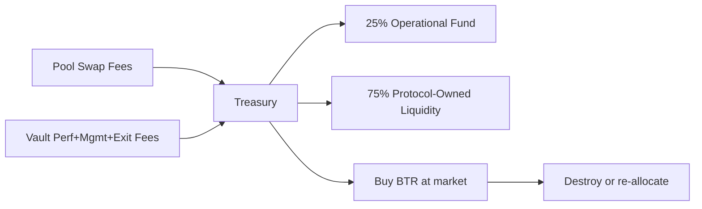

# Emission Control

> Halving-curve emission scheduling with governance-adjustable parameters and protocol fee integration

---

## 1. Overview

**Emissions** (65M BTR total over ~10 years) are distributed according to a **logarithmic decay curve** designed to:

- **Front-load liquidity incentives**: Heavy early emissions encourage initial participation
- **Sustainable tail**: Low tail emissions after 10 years ensure continued incentives
- **Governance flexibility**: Parameters adjustable within bounds for market conditions
- **Supply certainty**: Hard cap of 65M prevents hyperinflation

**Key principle**: Emissions prioritize **long-term protocol sustainability** over short-term token dumping.

---

## 2. Emission Schedule Overview

### 2.1. Total Supply Allocation

```
Total BTR supply: 100M (immutable cap)

Breakdown:
- Emissions:     65M (65%)  → Liquidity incentives over ~10 years
- Treasury:      20M (20%)  → DAO operations & strategic spending
- Team/Advisors: 12M (12%)  → Vesting over 5 years
- LBP:           3M  (3%)   → Fair-launch token sale
```

### 2.2. Emission Distribution

Of the 65M BTR emissions:

| Recipient | % | BTR Amount | Frequency |
|-----------|---|-----------|-----------|
| **sLP (liquidity providers)** | 90% | 58.5M | Weekly halving adjustments |
| **sBTR (governance stakers)** | 5% | 3.25M | Continuous, claimed on-demand |
| **Emissions treasury** | 5% | 3.25M | Discretionary, governance-approved |

---

## 3. Emission Curve & Halving Schedule

### 3.1. Halving-Curve Formula

Base emission rate follows a **geometric halving progression**:

$$E(t) = E_0 \cdot h^{\lfloor t / H \rfloor}$$

where:
- $E(t)$ = emission rate at time $t$ (in weeks)
- $E_0$ = base emission rate (initial, BTR/week)
- $h$ = halving factor (e.g., 0.5 = 50% reduction per cycle)
- $H$ = halving interval (e.g., 104 weeks = 2 years)
- $\lfloor \ldots \rfloor$ = floor function (discrete halving events)

### 3.2. Default Parameters

> **Calibration status:** The numeric values below (E₀, H, h) are **illustrative placeholders pending TGE calibration**. The cumulative emissions of a geometric halving schedule converge to $E_0 \cdot H / (1 - h)$ (in BTR), so the (E₀, H, h) triple is constrained jointly at TGE by the identity $E_0 \cdot H / (1 - h) = 65{,}000{,}000$. The 65M emissions cap is governance-fixed; the (E₀, H, h) calibration triple is chosen at TGE to satisfy the cap constraint.

| Parameter | Placeholder | Role |
|-----------|-------------|------|
| **E₀ (base rate)** | TBD at TGE | Initial weekly emission |
| **H (halving interval)** | TBD at TGE (Bitcoin-style 2-year cycle is the design intent) | Period between halvings |
| **h (halving factor)** | TBD at TGE (0.5 design intent) | Fraction of previous-period rate after each halving |

### 3.3. Halving Schedule (Symbolic)

Per-period emissions follow $E(t) = E_0 \cdot h^{\lfloor t/H \rfloor}$. Cumulative emissions over period $n$ are $E_0 \cdot H \cdot (1 - h^{n+1}) / (1 - h)$ and converge to $E_0 \cdot H / (1 - h)$ as $n \to \infty$. The (E₀, H, h, cap) parameters will be solved jointly at TGE so that the geometric sum equals the targeted emission allocation; numeric examples will be republished post-calibration.

---

## 4. Governance Control & Adjustability

### 4.1. Parameter Bounds

Emissions can be adjusted via governance within strict bounds:

| Parameter | Current | Bounds (design intent) | Change per vote |
|-----------|---------|------------------------|-----------------|
| **E₀** | TBD at TGE | bounded around TGE value | ±10k BTR/week |
| **H** | TBD at TGE (design intent: 104 weeks) | [78 weeks (1.5 yr), 156 weeks (3 yr)] | ±26 weeks |
| **h** | TBD at TGE (design intent: 0.5) | [0.4 (60% reduction), 0.6 (40% reduction)] | ±0.05 |

**Rationale for bounds**:
- **E₀ bounds**: Prevent extreme acceleration or starvation around the TGE-calibrated rate.
- **H bounds**: Prevent both hyperdecay (< 1.5 years) and an effectively infinite tail (> 3 years).
- **h bounds**: Ensure meaningful halving (40-60% reduction per cycle).

Concrete E₀ bounds will be set at TGE relative to the final E₀ calibration.

### 4.2. Change Process

Governance can adjust emission parameters via:

1. **Proposal phase** (48-72 hours):
   - Council proposes parameter change (e.g., E₀ increase from 62.5k to 65k BTR/week)
   - Community discussion
   - Impact analysis published (new end date, tail emissions, etc.)

2. **Voting phase** (7 days):
   - Snapshot vote with simple majority threshold (50%+)
   - Voting power calculated at snapshot block

3. **Timelock phase** (7 days):
   - Waiting period before execution
   - Community can exit if proposal turns problematic

4. **Execution phase**:
   - New parameter takes effect
   - Next emission cycle calculated with new parameter

### 4.3. Emission Routing Adjustment

Distribution of emissions across recipients can be adjusted within bounds:

| Recipient | Default | Min | Max |
|-----------|---------|-----|-----|
| **Stake pool participants** (sLP - DEX LP shares, and forward-looking sVault - vault shares) | 90% | 80% | 95% |
| **sBTR stakers** | 5% | 2% | 10% |
| **Emissions treasury** | 5% | 3% | 10% |

> The 90% slice covers **all governance-registered stake pools**. Currently DEX sLP holders consume the full slice; once the Vault stake pool (sVault) ships, governance reallocates within the 90% (e.g. 80% sLP / 10% sVault) or adds a 4th line. See [Distributor](./05.%20Distributor.md).

**Use case for rebalancing**:
- If LP participation is too high: Increase sBTR % to incentivize governance
- If community governance is weak: Decrease treasury % to increase staker rewards
- Adjustments encourage protocol-wide participation optimization

---

## 5. Real-Time Emission Minting

### 5.1. On-Demand Minting

Emissions are **not pre-minted**. Instead:

1. **Distributor module** tracks accrued emissions (off-chain)
2. **User claim** triggers on-demand mint from Treasury
3. **Treasury verification** checks against emission cap
4. **Token minted** to user/pool

**Benefits**:
- No risk of pre-minting and losing tokens
- Flexible timing (claim whenever convenient)
- Transparent cap enforcement (every mint verified)

### 5.2. Emission Cap Enforcement

Treasury tracks **claimed emissions** vs. **total cap**:

```solidity
emissionsClaimed += amountMinted;

if (emissionsClaimed > emissionsCap) {
    revert EmissionsCapExceeded();
}
```

**Hard stop**: Once 65M is claimed, no more emissions possible (new parameter required).

### 5.3. Per-Recipient Tracking

Distributor tracks per-recipient emission rates:

```
Weekly tracking (symbolic; numeric split applied to TGE-calibrated E(t)):
- sLP farming: 90% of current E(t)
- sBTR staking: 5% of current E(t)
- Emissions treasury: 5% of current E(t)

Total: 100% of current E(t)
```

Adjustments propagate immediately to next minting cycle.

---

## 6. Emissions Economics

### 6.1. APY Projection

> All APY figures below are placeholders pending TGE calibration of (E₀, H, h). Numeric examples will be republished alongside the final emission tuple. The qualitative shape - high APY in the first halving period, geometric decay across subsequent periods, asymptotic tail - is the design intent regardless of the specific calibration.

*Illustrative only. Not a forecast. Assumes static TVL, constant token price, and uninterrupted emission schedule. Actual APY varies with TVL, token price, governance changes, and emission halving. See [Risk Disclaimer](../legal/risk-disclaimer.md#governance-and-emissions-risk).*

**Key takeaway**: Early participants earn exceptional returns; late comers earn market-rate returns.

### 6.2. LP Incentive Decomposition

For an individual LP in pool X:

```
Annual LP reward is calculated as (TVL_X / Total_TVL) × (Coverage_X weight) × (Utilization_X weight) × 58.5M BTR

Example:
- Pool share: 10% of total protocol TVL
- Coverage: 100% (fully collateralized) → 1.0x weight
- Utilization: 70% (optimal) → 1.0x weight

Annual reward = 0.10 × 1.0 × 1.0 × 58.5M = 5.85M BTR (shared among all LPs in pool)
```

Individual LP APY then depends on **percentage of pool LP supply** owned.

---

## 7. Fee Collection & Treasury Integration

### 7.1. Fee-to-Emissions Flow

Protocol fees are routed into treasury, which can be reinvested into POL or allocated to additional emissions:



**Effect**: Fee collection directly improves protocol sustainability, reducing reliance on treasury allocations.

### 7.2. Sustainability Analysis

**Breakeven point** (when fees cover operational costs):

```
If annual opex = $5M
And protocol fee stream = $50k/month = $600k/year

Time to breakeven ≈ 8-10 years (after emissions decline)
```

Early emissions provide runway; later fees support sustainability.

---

## 8. Emissions Governance History & Adjustments

### 8.1. Version History

| Version | E₀ | H | h | Date | Reason |
|---------|-----|------|-----|------|--------|
| **v1** | TBD | TBD | TBD | TGE | Initial calibration (pending) |

### 8.2. Governance Proposal Examples

**Example 1: Acceleration** (if liquidity is scarce)
```
Current:  (E₀, H, h) = TGE calibration
Proposed: increase E₀ by ~10-15%, keep H and h
Rationale: market downturn → need more incentives
Vote:     pass with simple majority
Effect:   higher weekly emissions; cap reached sooner
```

**Example 2: Extension** (if protocol is thriving)
```
Current: h = 0.5
Proposed: h = 0.6 (60% reduction per cycle, slower decay)
Rationale: Protocol sustains indefinitely; tail emissions needed
Vote: Pass with 78% approval
Effect: Emissions extended to Year 12+ with slower tail
```

---

## 9. Emergency Procedures

### 9.1. Emission Pause

If critical issue discovered:

1. **Emergency vote** (Council can initiate without waiting)
2. **Pause emissions** (temporary stop to new minting)
3. **Investigation period** (72 hours community review)
4. **Resolution vote** (resume, adjust, or permanent change)

### 9.2. Cap Adjustment (Supermajority Only)

If emissions cap of 65M proves insufficient:

1. **Supermajority vote** (67%+ approval required)
2. **Timelock** (14 days, double normal duration)
3. **Community exit period** (7 days after timelock ends before execution)
4. **New cap takes effect** (extremely rare, governance consensus required)

---

## 10. Code References

### 10.1. Emission Configuration

**Contract**: `Treasury.sol`

Functions:
- `initializeEmissions(uint256 _cap)` -Set initial cap (65M BTR)
- `mintEmissionsToDistributor(uint256 amount)` -Mint from cap, checked on-chain
- `requestEmissionsCapChange(uint256 newCap)` -Queue new cap (7-day timelock)
- `executeEmissionsCapChange()` -Execute delayed cap change
- `cancelEmissionsCapChange()` -Cancel queued cap change before ETA

### 10.2. Distributor Integration

**Contract**: `Distributor.sol`

Tracks:
- `emissionSchedule` -Current halving curve parameters
- `perRecipientRate` -90/5/5 split among sLP/sBTR/treasury (reallocates to include sVault once the Vault stake pool ships)
- `lastMintBlock` -Track when last emission occurred

### 10.3. SDK Integration

**Location**: `sdk/src/rewards/`

Provides:
- `voting-power.ts` -Voting power calculations with quadratic damping
- `earning-power.ts` -LP reward calculations with quadratic damping

---

## 11. Related Documentation

- [Governance](./07.%20Governance.md) -Voting on parameter changes
- [Treasury](./03.%20Treasury.md) -Treasury spending and fee collection
- [Staking](./04.%20Staking.md) -Reward distribution mechanics
- [Distributor](./05.%20Distributor.md) -Campaign-based emissions to stake pools

---

## 12. Design Rationale

**Community-First Allocation**:

Emissions should reward productive liquidity, not just deposits; vesting should ensure long-term commitment, not extraction.

65% emission allocation prioritizes **community-first** distribution over VC funding:
- Typical projects: 15-20% team + 15-30% investors + 5-10% public = 35-60% "extractive"
- BTR Protocol: 65% community emissions + 20% treasury (DAO-controlled) = 85% available for actual protocol participants

---

## References

- Bitcoin Halving: [Emission Schedule Design](https://en.wikipedia.org/wiki/Bitcoin#Emission_schedule)
- Ethereum Issuance: [EIP-1559 Fee Burn](https://eips.ethereum.org/EIPS/eip-1559)
- Curve Gauge Weights: [Emissions Allocation](https://docs.curve.fi/governance/gauges/)
