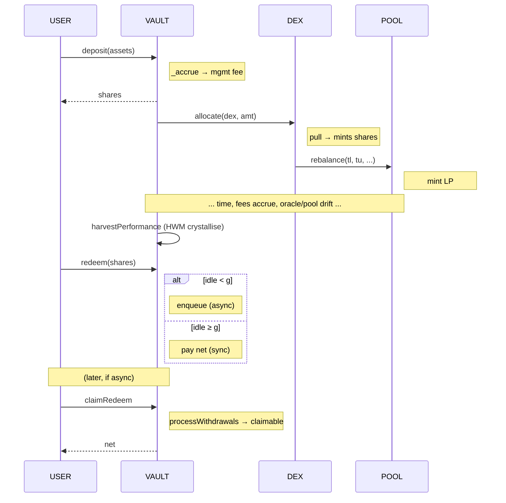

# 6. Lifecycle

> Every state transition a Vault goes through, end-to-end.

---

## 1. Deploy & Wire

```text
1. owner → AccessControl(owner, treasury) deployed              // immutable per chain
2. owner → PriceProvider(ac), set Chainlink feeds (instant first time)
3. owner → Swapper(ac), AC.bootstrapSwapper(swapper)            // one-shot
4. owner → Factory(ac, vaultImpl, dexImpl), AC.bootstrapFactory(factory)
5. anyone → Factory.deployVault(asset, name, symbol)            // permissionless clone
6. owner → Factory.deployDex(); Dex.initPool(...); Dex.setHolder(vault, true)
7. owner → Vault.addAdapter(dex)                                // strict _sync inside
```

`Vault.init` (`Vault.sol:109`) is `initializer`-guarded -re-init impossible on the clone.

## 2. Deposit (Sync Only)

```text
user → Vault.deposit(assets, receiver)            // Vault.sol:205
       OR Vault.mint(shares, receiver)            // :212
```

- `_accrue()` runs first (`:207`).
- Reverts if `!_healthy()` (`whenHealthy` modifier).
- Caps: `depositCap` (`:222`).
- Anti-dust: `shares == 0` reverts with `Dust()` (`:220`).
- Issues fungible ERC-20 vault shares.

There is no async deposit. `_healthy()` is the only deposit gate.

## 3. Redeem (Hybrid 4626 / 7540)

### 3.1. `redeem(shares, receiver, owner)` -`Vault.sol:235`

Auto-routes by health and idle:

```text
if _healthy() && grossAssets ≤ idle:
    SYNC PATH  → burn shares, fee → treasury, net → receiver
                 returns net assets
else:
    ASYNC PATH → burn shares, enqueue ticket (Pending), reservedAssets += g
                 emits RedeemRequest, returns 0
```

### 3.2. `withdraw(assets, receiver, owner)` -`Vault.sol:254`

Strict ERC-4626. Sync only. Reverts `WithdrawAsync` when the async path would have triggered. For integrators (Pendle, Morpho, Euler) that cannot handle async returns.

### 3.3. `requestRedeem(shares, controller, owner)` -`Vault.sol:270`

ERC-7540 explicit. Always async. Returns a unique `requestId`.

## 4. Cohort Settlement

```text
keeper → Vault.processWithdrawals(controllers[])   // sorted ascending, unique
```

(`Vault.sol:309`.) For each controller:

1. Sum `needed = Σ pendingRedeem[c].assets`.
2. `available = balance − claimableAssets − (reservedAssets − needed)`.
3. Cohort haircut `hcBps = min(10_000, available × 10_000 / needed)`.
4. Each ticket migrates `pendingRedeem[c]` → `claimableRedeem[c]` with shares-weighted blended `feePip`.

Permissionless. Reverts `Insolvent` if `available == 0` or post-condition `bal < reservedAssets + claimableAssets`.

## 5. Claim

```text
controller (or operator) → Vault.claimRedeem(controller, receiver)
```

(`Vault.sol:364`.) Pays `cl.assets`, capped by current contract balance share. Fee = `cl.feePip × g`, transferred to treasury. Net to receiver.

## 6. Allocate / CollectFrom

```text
owner|keeper → Vault.allocate(adapter, amount)        // :502
owner|keeper → Vault.collectFrom(adapter, amount)     // :512
```

`allocate` calls `Dex.pull(amount)` after a one-shot approval; mints adapter shares; calls `_sync` to refresh `lastReported`. `collectFrom` calls `Dex.withdraw(vault, amount)` to materialize idle from the adapter (bounded by adapter's idle `token0`); subsequent `_sync` updates the cached mark.

## 7. SyncAdapter (Permissionless)

```text
anyone → Vault.syncAdapter(adapter)                   // :520
```

Re-marks `lastReported` and bumps `lastSync`. Critical after a sequencer recovery or a transient oracle outage -restores health without operator intervention. Strict (no try/catch); reverts if the adapter's `assetValue` reverts.

## 8. Rebalance Routes -Atomic vs Intent

`Dex.rebalance(tickLower, tickUpper, routes[])` (`Dex.sol:304`) supports up to 8 routes per call:

```solidity
struct Route { uint8 kind; uint256 minOut; uint64 deadline; bytes payload; }
enum RouteKind { Atomic, Intent }
```

For each route:

- **Atomic** -Swapper executes via pinned LiFi router synchronously.
- **Intent** -Swapper opens an ERC-7683 intent at the pinned settler. Returns immediately. The route is "in flight" until `Swapper.settleIntent(intentId)` is called (permissionless).

Post-mint slip envelope (`maxSlipBps`) only enforced when **all** routes are atomic; mixed sets rely on per-route `minOut` + Swapper's per-intent enforcement at settle.

## 9. Harvest Performance

```text
owner|keeper → Vault.harvestPerformance()             // :442
```

Crystallizes the HWM perf-fee. The **only** site that updates `(hwmAssets, hwmSupply)`. Mints perf-shares to `ac.treasury()`. Same-block re-entry returns no-op via `_accrue`'s timestamp check + the strict gain guard.

## 10. Operator Salvage

```text
owner → Vault.salvage(token, amount, minOut, routerData)   // :539
```

Routes a stuck non-asset token through the Swapper back to vault asset. Reverts on `_asset` and on `address(this)`.

## 11. Sequence Diagram -End-to-End Deposit → Yield → Exit


